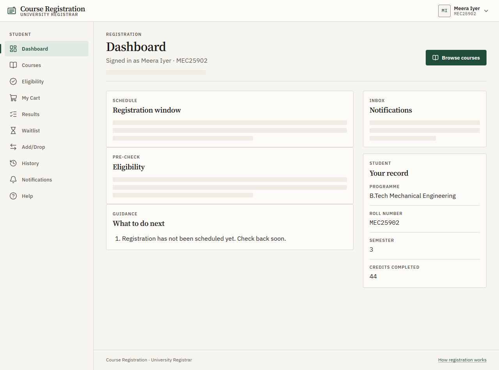

# Course Registration and Elective Allocation Platform

A web platform for fair course registration: live seat counts, an eligibility
pre-check, a registration cart with atomic submit, preference-and-priority
allocation for oversubscribed electives, waitlists with automatic promotion,
add/drop, and a personal registration history.

> **Status: Phase 5 (course catalogue).** The stack, database schema, seed
> data, sign-in with role-based access, the design system and app shell, and
> the first feature, the course catalogue with live seat counts, are in place.
> The other features arrive in later phases. The full README comes in the final
> phase.

- Brief: [docs/PROBLEM_STATEMENT.md](docs/PROBLEM_STATEMENT.md)
- Specification: [docs/SPEC.md](docs/SPEC.md)
- Database design: [docs/DATABASE.md](docs/DATABASE.md)
- Design direction and review: [docs/DESIGN.md](docs/DESIGN.md) (screenshots in
  [docs/screenshots/](docs/screenshots/))



## Features

| #   | Feature (from the brief)                      | Status               |
| --- | --------------------------------------------- | -------------------- |
| 1   | Course catalogue with live seat counts        | **Done** (see below) |
| 2   | Eligibility pre-check before the window opens | **Done** (see below) |
| 3   | Registration cart with atomic submit          | **Done** (see below) |
| 4   | Fair allocation for oversubscribed electives  | **Done** (see below) |
| 5   | Waitlist with automatic promotion             | **Done** (see below) |
| 6   | Add/drop                                      | **Done** (see below) |
| 7   | Registration status and history               | **Done** (see below) |

**Course catalogue** (`/student/courses`):

- Every offering in the current window, with capacity, allocated, available,
  demand (submitted requests) and the demand ratio. For students it also shows
  their eligibility, with reasons, and their own status.
- Search (debounced), department, credits, "eligible only" and "seats left"
  filters and five sort orders, all kept in the URL so a view can be shared or
  refreshed. Card and table views; the table's row buttons use event delegation.
- Seat numbers refresh every 10 s while the tab is visible. The poll sends the
  last ETag and gets a bodiless 304 when nothing changed. Changed numbers flash
  briefly.
- Course detail (`/student/courses/:code`): full description, every
  eligibility reason, prerequisites met or not, eligible programmes, seats and
  status. Its back link keeps the catalogue filters.
- Admin courses (`/admin/courses`): a sortable table of all offerings with
  oversubscribed rows marked, and "Edit capacity" (reason required, never below
  the allocated seats, written to `audit_logs`).

**Eligibility pre-check** (`/student/eligibility`):

- Every offered course checked against the student's own record — programme,
  semester, credits and passed courses — with the record shown beside it, so
  they can see what the check judged them on.
- Courses are grouped into Eligible and Not eligible (collapsible), and each
  ineligible course lists **every** reason in plain English ("Needs semester 5
  — you're in semester 4", "Complete CS201 Data Structures first").
- It works while the window is still a draft. That is the point: check before
  registration opens, not after it closes.
- A registration banner on every student page counts down to the opening or
  closing, measured against the **server's** clock, so a wrong device clock
  can't mislead anyone.

**Registration cart** (`/student/cart`):

- Add or remove a course from the catalogue cards, the catalogue table or the
  course detail page. All three use the same delegated `data-action` handler
  and the same rule for what to offer, so an ineligible course explains itself
  instead of showing a dead button and a full cart says so.
- Rank up to five choices with Move up / Move down (drag-and-drop is an extra,
  never the only way). Focus stays on the moved item and a polite live region
  announces its new position. Unsaved changes are shown, warned about on
  leaving the page, and persisted with **Save draft**.
- **Submitting is one transaction with an idempotency key.** The confirm dialog
  generates one `crypto.randomUUID()` and reuses it for every retry, so a
  network failure is safe to retry and cannot create a duplicate. There is
  never a partial submission, and the arrival order comes from a database
  sequence. Afterwards the page shows an immutable receipt with the reference,
  the time and the arrival number.
- How this is guaranteed, with a sequence diagram:
  [docs/CONCURRENCY.md](docs/CONCURRENCY.md).

**Registration window** (`/admin/registration-window`):

- Schedule the window, choose the offered courses, and pick the allocation
  method. The method-specific settings render from the `AllocationConfig`
  union, so Preference + Priority shows the P1–P5 weights, the priority points
  and the tie-break seed, while FCFS shows why it rewards fast connections.
- Opening registration **freezes the policy**: method, weights, priority
  points, seed and the set of offered courses can no longer change. The service
  answers `409`, and a database trigger rejects the change even if it is
  attempted directly. Seats per course stay editable.
- Opening also notifies every student, in the same transaction. Every change,
  open and close is written to `audit_logs` with old and new values.

**Allocation** (`/admin/allocation-runs`, `/student/results`):

- Two methods behind one `AllocationStrategy` interface: **FCFS** (submission
  order) and **Preference + Priority** (student-proposing deferred
  acceptance). The engine is a pure function — no database, no clock, no
  `Math.random` — so a run is reproducible and testable without a server.
- Score = preference weight (P1 100 … P5 20) + final year +20 + programme
  relevance +25 + graduation urgency +40, with ties broken by one seeded
  number per student. Students see the score as the sum it actually is.
- **Preview** runs both methods on a fresh snapshot and shows them side by
  side, writing nothing. On the demo data: identical first-choice rates, but
  FCFS leaves **78** cases of justified envy against Preference + Priority's
  **0**.
- **Run** is one transaction: results, enrollments, waitlist entries, history,
  a notification per student, an audit row, then the window becomes
  `ALLOCATED`. It can only complete once. A fault injected mid-way rolls back
  every table and records the run as `FAILED`.
- **Verify** re-runs the stored input snapshot through the same algorithm
  version and compares output hashes.
- Students get a plain-English explanation per ranked course — "Waitlisted,
  #7. You ranked it 1st. Your score for this course was 145 (1st preference
  100 + final year 20 + programme relevance 25). 20 seats went to applicants
  with scores of 150 or higher." — and never see another student's data.
- The full rule book, with a worked example and the fairness argument:
  [docs/ALLOCATION.md](docs/ALLOCATION.md).

**Accounts and records** (`/admin/students`, `/admin/course-catalogue`) — the
platform no longer relies on seeded data. Administrators create student
accounts and the students activate them from an e-mailed, single-use link;
courses and their rules are maintained by hand or imported from a CSV, in a
preview-then-confirm flow that writes every valid row in one transaction. The
whole lifecycle is described under [Accounts](#accounts).

**Dashboards** — the student dashboard loads the window, the eligibility
summary and the notification count together with `Promise.allSettled`, so one
failing section shows its own Retry while the rest of the page still works. It
also shows the cart and what to do next. The admin dashboard shows the window,
its counts and the five most demanded courses.

How the JavaScript and TypeScript concepts are used is written up in
[docs/javascript-concepts.md](docs/javascript-concepts.md).

## Stack

| Layer    | Technology                                                                                         |
| -------- | -------------------------------------------------------------------------------------------------- |
| Frontend | React 19, TypeScript, Vite 6, React Router 7, CSS Modules                                          |
| Backend  | Node 20.12+ (developed on 20 and 24), Express 5, TypeScript, `pg` (PostgreSQL 16), zod, nodemailer |
| Shared   | `@course-reg/shared` — typed API contracts (`ApiResponse<T>`, …)                                   |
| Tooling  | ESLint (type-aware), Prettier, Vitest, React Testing Library, supertest                            |
| Runtime  | Docker, Docker Compose, Mailpit (development mail)                                                 |

```text
.
├── backend/    Express API (routes → controllers → services → repositories)
├── frontend/   React SPA (components → hooks → api)
├── shared/     Types shared by both sides
├── docs/       Problem statement, specification, database design
├── docker/     PostgreSQL init scripts (creates the test database)
├── docker-compose.yml        Development stack (hot reload)
└── docker-compose.prod.yml   Production-like stack (nginx on :8080)
```

## Run with Docker (recommended)

Requires Docker Desktop (or Docker Engine with Compose v2).

```bash
cp .env.example .env          # then change POSTGRES_PASSWORD / DATABASE_URL
npm run docker:up             # docker compose up --build -d
```

| URL                              | What                                            |
| -------------------------------- | ----------------------------------------------- |
| http://localhost:5173            | Frontend (Vite, hot reload)                     |
| http://localhost:4000/api/health | Backend health (API + database)                 |
| http://localhost:8025            | **Mailpit** — every invitation and reset e-mail |
| localhost:5432                   | PostgreSQL                                      |
| localhost:1025                   | Mailpit's SMTP, which the backend sends through |

The backend waits for PostgreSQL to be healthy, applies migrations
(`npm run migrate`), then starts with hot reload. Source folders are
bind-mounted; `node_modules` live in named volumes so host and container
dependencies never mix. File watching uses polling so hot reload works on
Windows and macOS bind mounts.

| Script                        | Does                                                 |
| ----------------------------- | ---------------------------------------------------- |
| `npm run docker:up`           | Build and start the dev stack in the background      |
| `npm run docker:logs`         | Follow logs                                          |
| `npm run docker:down`         | Stop the dev stack (keeps data)                      |
| `npm run docker:reset`        | Stop and **delete volumes** (database, node_modules) |
| `npm run docker:prod`         | Build and start the production stack on :8080        |
| `npm run docker:prod:down`    | Stop the production stack                            |
| `npm run docker:admin:create` | Create an administrator account interactively        |

After changing dependencies, refresh the `node_modules` volumes with
`npm run docker:reset && npm run docker:up`.

**Production stack:** `npm run docker:prod`, then open http://localhost:8080.
nginx serves the built frontend and proxies `/api` to the backend; only port
8080 is published.

## Accounts

**Administrators create student accounts; students never self-register and never
choose their own academic data.** Programme, semester, credits and completed
courses are what eligibility and priority are judged on, so they belong to the
registrar — a student who could edit them would be deciding their own place in
the allocation.

### The lifecycle

1. **Invitation.** An administrator creates the student at `/admin/students`.
   The account is created and the invitation e-mailed in **one transaction**: if
   the e-mail cannot be sent, nothing is created, because an account nobody can
   be told about is worse than no account.
2. **Activation.** The link opens `/activate?token=…`, where the student chooses
   a password (at least 10 characters, with a strength hint) and is signed in
   straight away. The link works **once** and expires after 48 hours.
3. **Resending.** "Resend invitation" mints a new link and spends the old one,
   so the previous e-mail stops working the moment the new one is sent.
4. **Forgotten passwords.** `/forgot-password` answers with the **same message
   whether or not the address exists** — same status, same body, and the same
   answer when sending fails, so a mail outage cannot become a way of
   discovering which addresses exist. The link behaves exactly like an
   activation link.
5. **Changing a password.** `/student/account` and `/admin/account` (linked from
   the user menu) take the current password and set a new one.
6. **Deactivation.** A deactivated account cannot sign in and its open sessions
   end on their next request. **Nothing is deleted** — every submission,
   enrolment, waitlist place and history row is kept, and reactivating restores
   access with the same password.

### What the security rests on

- **Links are stored as hashes.** Only the SHA-256 of a token reaches
  `account_tokens`, so a leaked table cannot be turned back into working links.
  Unknown, spent and expired links are **one answer**, so a guess learns nothing.
- **Redeeming a link is one transaction** over a locked token row, so two
  requests carrying the same link cannot both set a password.
- **Setting a password ends every other session.** `users.password_changed_at`
  is the cut-off, compared against each session token's `iat`; the device that
  made the change gets a fresh cookie in the same response, so it stays signed
  in while the others are signed out. Every outstanding link dies with it.
- **Deactivated and never-activated accounts are refused**, the first only
  _after_ the password has been checked — so a guesser who does not know the
  password learns nothing, while the person who does is told why they are out.
- **The public account endpoints are rate limited** per IP (20 per 15 minutes),
  keyed on the address alone: keying on the e-mail would turn the limiter itself
  into the oracle `/forgot-password` refuses to be.

### Reading the e-mail in development

The Docker stack runs [Mailpit](https://mailpit.axllent.org/), which accepts
every message and shows it instead of delivering it:

| URL                   | What                                       |
| --------------------- | ------------------------------------------ |
| http://localhost:8025 | **The inbox** — every invitation and reset |
| localhost:1025        | SMTP, which the backend is pointed at      |

Running on the host without `SMTP_HOST` set, account e-mails are written to the
backend log instead (link included) so the flow still works. `NODE_ENV=production`
refuses to start without a real `SMTP_HOST`.

### The first administrator

Production starts with an **empty database plus the migrations**: the seed and
every demo script refuse to run there, with no override. The first
administrator is created on the server:

```bash
npm run admin:create              # or: npm run docker:admin:create
```

It prompts for an e-mail and a password (hidden while typed), re-asks on
anything invalid, refuses an address that already has an account, and writes an
`ADMIN_CREATED` audit row. From there, students are invited from
`/admin/students`.

Demo-seeded accounts count as already activated, so `npm run demo:reset` works
exactly as before, and the sign-in page shows the demo credentials **only in a
development build** — the component holding them is removed by the bundler
otherwise, along with the `/dev/components` gallery route.

That guarantee does not depend on the environment: Vite decides
`import.meta.env.DEV` from `NODE_ENV`, not from the build mode, so
`npm run build` on a machine with `NODE_ENV=development` exported used to
produce a deployable bundle that rendered them. `vite.config.ts` now forces
`NODE_ENV=production` for `vite build`; `vite build --mode development` still
opts out, because that mode is asked for rather than inherited.

### Managing students and courses

| Page                      | What                                                                                                                         |
| ------------------------- | ---------------------------------------------------------------------------------------------------------------------------- |
| `/admin/students`         | Every account, searchable and filterable by programme, semester and status (invited / active / inactive). Create, and import |
| `/admin/students/:roll`   | One student's record, their standing and their timeline, plus resend invitation and deactivate / reactivate                  |
| `/admin/course-catalogue` | The course records and their rules: create, edit, retire, reinstate, and import                                              |
| `/admin/courses`          | The current window's **offerings** — seats and demand (unchanged)                                                            |

A course is **retired, never deleted**, and cannot be retired while a window
that is `OPEN` or later offers it: the button says so, the server answers `409`
naming the windows, and a trigger is the final guard. A new course can be added
to a window's offerings only while that window is a `DRAFT`.

Every create, edit, import, invitation, deactivation and retirement writes an
`audit_logs` row with its old and new values.

### CSV import

Both `/admin/students` and `/admin/course-catalogue` import a CSV in two steps:
**upload → preview → confirm**. The preview judges every row and writes
nothing; the confirm re-judges the file (the verdicts the browser saw are not a
credential) and writes every valid row in **one transaction**, reporting what
each row became. Nothing is ever imported halfway and silently.

Download the template from the panel. The columns, in any order — extra columns
are ignored, and lists inside a cell are separated by spaces:

| File     | Columns                                                                                                                                      |
| -------- | -------------------------------------------------------------------------------------------------------------------------------------------- |
| Students | `rollNumber`, `name`, `email`, `program`, `semester`, `creditsCompleted`, `expectedGraduationTerm`, `completedCourses`                       |
| Courses  | `code`, `name`, `credits`, `department`, `description`, `minSemester`, `minCredits`, `prerequisites`, `eligiblePrograms`, `relevantPrograms` |

```csv
rollNumber,name,email,program,semester,creditsCompleted,expectedGraduationTerm,completedCourses
CSE26001,Asha Menon,asha.menon@university.edu,BTECH-CSE,5,88,2028-SPRING,MA201 CS201
```

Each imported student is invited by e-mail. Unlike a single create, a failing
invitation does **not** roll the import back — thirty accounts should not be
lost to one bounced address — and the report says how many went out, so the rest
can be invited again from their own page. A course import may name a
prerequisite that an earlier row of the same file creates.

## Authentication

Sign in at `/login`. In development the page lists the
[demo accounts](#demo-accounts); students land on `/student`, administrators on
`/admin`.

- **Session cookie.** `POST /api/auth/login` checks the password with bcrypt and
  sets a signed JWT (HS256, user id + role, 8 hours) in the `cr_session` cookie:
  `HttpOnly` (JavaScript can't read it), `SameSite=Strict`, `Path=/api`, and
  `Secure` in production. The token is never in a response body or localStorage.
- **No account enumeration.** An unknown e-mail and a wrong password give the same
  401 message, and both paths run a bcrypt comparison so timing looks the same.
- **Brute-force limit.** At most 10 failed sign-ins per IP and e-mail every 15
  minutes, then `429`.
- **CSRF.** Besides `SameSite=Strict`, state-changing requests with a foreign
  `Origin` header are rejected (`403`).
- **Authorization on the server.** Every request re-validates the cookie and
  re-loads the user (`requireAuth`); `requireRole` returns `403` for the wrong
  role. Student endpoints take the student's identity from the session, never
  from an id in the request. Admin sign-ins are written to `audit_logs`.
- **Frontend.** `AuthProvider` restores the session via `GET /api/auth/me`;
  `<ProtectedRoute>` sends visitors to `/login` (and back afterwards) and sends
  users of the other role to their own home. If a session expires, the next API
  call sends you to `/login` with a notice.

| Endpoint                | Access    | Purpose                                            |
| ----------------------- | --------- | -------------------------------------------------- |
| `POST /api/auth/login`  | public    | Sign in; sets the session cookie; returns the user |
| `POST /api/auth/logout` | public    | Clears the session cookie                          |
| `GET /api/auth/me`      | signed in | Current user (plus profile summary for students)   |
| `GET /api/students/me`  | student   | The caller's own student profile                   |
| `GET /api/admin/ping`   | admin     | Role check                                         |

| Account endpoint                  | Access    | Purpose                                                                                       |
| --------------------------------- | --------- | --------------------------------------------------------------------------------------------- |
| `GET /api/auth/activation/:token` | public    | Is this link usable, and whose is it? Always `200`; spent, expired and unknown are one answer |
| `POST /api/auth/activate`         | public    | `{ token, password }`: sets the first password and signs in                                   |
| `POST /api/auth/forgot-password`  | public    | `{ email }`: the same `200` and message whether or not the address exists                     |
| `POST /api/auth/reset-password`   | public    | `{ token, password }`: replaces the password, signs other devices out, signs this one in      |
| `PUT /api/account/password`       | signed in | `{ currentPassword, newPassword }`, either role. Signs every other device out                 |

The four public ones share one rate limit, per IP (20 per 15 minutes).

| Student records endpoint                          | Access | Purpose                                                       |
| ------------------------------------------------- | ------ | ------------------------------------------------------------- |
| `GET /api/admin/students`                         | admin  | `search`, `program`, `semester`, `status`, `page`, `pageSize` |
| `POST /api/admin/students`                        | admin  | Creates the account and e-mails the invitation, atomically    |
| `GET /api/admin/students/:rollNumber`             | admin  | The record, their standing and their timeline                 |
| `PATCH /api/admin/students/:rollNumber`           | admin  | Saves every field together; audited with old and new values   |
| `POST /api/admin/students/:rollNumber/invitation` | admin  | Mints a new link and spends the outstanding one               |
| `POST /api/admin/students/:rollNumber/deactivate` | admin  | Blocks sign-in; keeps every row                               |
| `POST /api/admin/students/:rollNumber/reactivate` | admin  | Restores access with the same password                        |
| `POST /api/admin/students/import/preview`         | admin  | Judges every row of a CSV; writes nothing                     |
| `POST /api/admin/students/import`                 | admin  | Re-judges it and writes every valid row in one transaction    |
| `GET /api/admin/reference-data`                   | admin  | Programmes, departments and courses for the forms' pickers    |

| Course catalogue endpoint                           | Access | Purpose                                                            |
| --------------------------------------------------- | ------ | ------------------------------------------------------------------ |
| `GET /api/admin/course-catalogue`                   | admin  | Every course with its rules and where it is offered                |
| `POST /api/admin/course-catalogue`                  | admin  | Creates a course and its three rule lists                          |
| `PATCH /api/admin/course-catalogue/:code`           | admin  | Replaces the rules. The code itself cannot change                  |
| `POST /api/admin/course-catalogue/:code/deactivate` | admin  | Retires it. `409` while a window that is `OPEN` or later offers it |
| `POST /api/admin/course-catalogue/:code/reactivate` | admin  | Lets it be offered again                                           |
| `POST /api/admin/course-catalogue/import/preview`   | admin  | Judges every row; writes nothing                                   |
| `POST /api/admin/course-catalogue/import`           | admin  | Re-judges it and writes every valid row in one transaction         |

| Catalogue endpoint                        | Access    | Purpose                                                                                                                                                      |
| ----------------------------------------- | --------- | ------------------------------------------------------------------------------------------------------------------------------------------------------------ |
| `GET /api/registration-windows/current`   | signed in | The OPEN (else latest) window and the server time                                                                                                            |
| `GET /api/courses`                        | signed in | Catalogue page: `search`, `department`, `credits`, `onlyAvailable`, `onlyEligible`, `sort`, `order`, `page`, `pageSize` (≤ 48); personal fields for students |
| `GET /api/courses/:code`                  | signed in | One course in full, prerequisites met or not                                                                                                                 |
| `GET /api/courses/seats`                  | signed in | Seat numbers only, with `ETag`; `If-None-Match` → `304`                                                                                                      |
| `GET /api/admin/courses`                  | admin     | Every offering with seats, demand and an oversubscribed flag                                                                                                 |
| `PATCH /api/admin/courses/:code/capacity` | admin     | `{ capacity, reason }`; `409` below the allocated seats; audited                                                                                             |

| Eligibility and window endpoint                   | Access  | Purpose                                                                                      |
| ------------------------------------------------- | ------- | -------------------------------------------------------------------------------------------- |
| `GET /api/eligibility`                            | student | Every offered course checked against the caller, plus their record and a summary. Any status |
| `GET /api/eligibility/:code`                      | student | The same for one course                                                                      |
| `GET /api/students/me/notifications/unread-count` | student | Unread notifications, for the dashboard                                                      |
| `GET /api/admin/registration-window`              | admin   | The window with its policy, counts and every course                                          |
| `PATCH /api/admin/registration-window`            | admin   | Schedule, offered courses and policy. `DRAFT` only: `409` once frozen                        |
| `POST /api/admin/registration-window/open`        | admin   | `DRAFT → OPEN`. Freezes the policy and notifies every student                                |
| `POST /api/admin/registration-window/close`       | admin   | `OPEN → CLOSED`                                                                              |

### The cart, allocation and waitlists

| Endpoint                                     | Who     | What                                                                         |
| -------------------------------------------- | ------- | ---------------------------------------------------------------------------- |
| `GET /api/preferences`                       | student | The caller's own cart                                                        |
| `PUT /api/preferences`                       | student | Saves the draft cart in rank order                                           |
| `POST /api/registration/submit`              | student | One atomic submit; needs an idempotency key; rate limited                    |
| `GET /api/registration/status`               | student | Whether they have submitted, and their reference                             |
| `POST /api/admin/allocation/preview`         | admin   | Both methods on a fresh snapshot. Writes nothing                             |
| `POST /api/admin/allocation/run`             | admin   | `CLOSED → ALLOCATED`. Once per window; needs `{ confirm: true }`             |
| `GET /api/admin/allocation-runs[/:id]`       | admin   | Past runs, with metrics and the per-course table                             |
| `POST /api/admin/allocation-runs/:id/verify` | admin   | Re-runs the stored snapshot and compares hashes                              |
| `GET /api/allocation/results`                | student | The caller's own outcome and the reasoning behind it                         |
| `GET /api/students/me/waitlist`              | student | The caller's own queues, with live positions                                 |
| `GET /api/admin/waitlists?course=CODE`       | admin   | One course's roster and queue                                                |
| `POST /api/admin/enrollments/:id/withdraw`   | admin   | `{ reason }`; releases a seat and promotes whoever is next, cascade included |
| `POST /api/admin/waitlists/process`          | admin   | The safety sweep: offers every free seat in the window to its waitlist       |

### The student's own record

| Endpoint                                        | Who     | What                                                                                                             |
| ----------------------------------------------- | ------- | ---------------------------------------------------------------------------------------------------------------- |
| `GET /api/students/me/status`                   | student | Where they stand now: window, submission, seat and how it was obtained, live waitlist positions, add/drop period |
| `GET /api/students/me/history`                  | student | Their timeline, newest first. `type`, `course`, `cursor`, `limit`; events carry structured facts, not sentences  |
| `GET /api/students/me/notifications`            | student | Their messages. `filter=unread\|all`, `cursor`                                                                   |
| `PATCH /api/students/me/notifications/:id/read` | student | Marks one read; idempotent, `404` for anybody else's. Returns the new unread count                               |
| `POST /api/students/me/notifications/read-all`  | student | Marks every unread one read. Returns the new unread count                                                        |

`JWT_SECRET` must be set in `.env` (at least 32 characters; see `.env.example`).
The server refuses to start in production with the example value.

## Seed data and demo accounts

```bash
npm run docker:seed                    # reset + load demo data (inside Docker)
npm run docker:seed:demo-submissions   # open Fall 2026 and add ~150 submissions
```

Outside Docker use `npm run seed` and `npm run seed:demo-submissions`. Both are
deterministic and safe to re-run; `seed` wipes all application data first.
See [docs/DATABASE.md](docs/DATABASE.md#seed-data) for what gets created.

`seed:demo-submissions` deliberately leaves **aarav.sharma** and **priya.nair**
without a submission, so the cart and the atomic submit can be demonstrated
live rather than described.

### Demo stages

```bash
npm run docker:demo:reset -- --stage=draft      # base seed, window not open yet
npm run docker:demo:reset -- --stage=open       # + ~150 submissions
npm run docker:demo:reset -- --stage=closed     # + registration closed
npm run docker:demo:reset -- --stage=allocated  # + allocation run for real
npm run docker:demo:reset -- --stage=add-drop   # + the add/drop period open
```

Each stage is cumulative and goes through the real service, not a shortcut
`UPDATE`: closing freezes the policy and notifies every student, and
allocating runs the same transaction the admin's button runs. Outside Docker:
`npm run demo:reset -- --stage=...`. It refuses to run in production.

### Proving the concurrency guarantees

```bash
npm run docker:demo:concurrent-submit                 # 50 students, default
npm run docker:demo:concurrent-submit -- --students=100
```

```bash
npm run docker:demo:seat-race                         # 100 students, 10 seats
npm run docker:demo:seat-race -- --students=200 --seats=20
```

`demo:seat-race` is the add/drop half: it prepares a course with exactly N free
seats, finds students who hold no elective and are eligible for it, and fires
one "add, or join the waitlist if full" per student at the same instant. It
then prints enrolled, waitlisted, overbooked, duplicate enrolments and whether
the waitlist positions are unique and consecutive. See
[docs/CONCURRENCY.md](docs/CONCURRENCY.md#the-seat-race-100-students-10-seats).

Every student fires their submit twice at the same instant with the same
idempotency key. The script then checks the database and prints PASS/FAIL for
duplicates, partial carts, one submission per student, and unique, gap-free
arrival numbers. Outside Docker: `npm run demo:concurrent-submit`. It refuses
to run with `NODE_ENV=production`.

### Demo accounts

> **Demo-only credentials.** They are published here so the app can be
> demonstrated, and the sign-in page lists them in a **development build only**.
> Never reuse them anywhere real. A real deployment starts with an empty
> database and its first administrator from `npm run admin:create`.

| Role    | E-mail                        | Password      | Situation                                                                                                                    |
| ------- | ----------------------------- | ------------- | ---------------------------------------------------------------------------------------------------------------------------- |
| Admin   | `admin@university.edu`        | `Admin@123`   | Manages courses, the registration window and allocation                                                                      |
| Student | `aarav.sharma@university.edu` | `Student@123` | CSE, semester 6: eligible for Artificial Intelligence (program relevance +25). **No submission** — use them to demo the cart |
| Student | `meera.iyer@university.edu`   | `Student@123` | Mechanical, semester 3: **not** eligible for Artificial Intelligence                                                         |
| Student | `rohan.verma@university.edu`  | `Student@123` | CSE, final year, graduating this term: highest priority (+20 +25 +40)                                                        |
| Student | `priya.nair@university.edu`   | `Student@123` | ECE, semester 5: eligible for Artificial Intelligence, no priority bonus. **No submission** — use them to demo the cart      |

The 296 generated students also use `Student@123`; their e-mail is their roll
number, e.g. `cse24004@university.edu`.

## Run without Docker

Requires Node.js ≥ 20.12 and a PostgreSQL 16 server.

```bash
cp .env.example .env    # point DATABASE_URL at your PostgreSQL
npm install
npm run migrate
npm run seed            # optional demo data
npm run dev             # backend on :4000, frontend on :5173
```

Tip: `docker compose up -d postgres` runs just the database in Docker.

## Quality checks

```bash
npm run lint           # ESLint, zero warnings allowed
npm run typecheck      # tsc in every workspace
npm run test           # Vitest in every workspace (backend integration tests need PostgreSQL)
npm run build          # shared → backend → frontend
npm run format:check   # Prettier
```
