# Allocademy

[](https://github.com/satyanshcancode/Course-Registration-and-Elective-Allocation-Platform/actions/workflows/ci.yml)
[](https://github.com/satyanshcancode/Course-Registration-and-Elective-Allocation-Platform/actions/workflows/deploy.yml)
[](https://allocademy.vercel.app)

**Course registration and elective allocation, done fairly.** A live course
catalogue, an eligibility pre-check before the window opens, a registration cart
that submits atomically, preference-and-priority allocation for oversubscribed
electives, waitlists that promote automatically as seats free up, add/drop, and
a personal registration history.

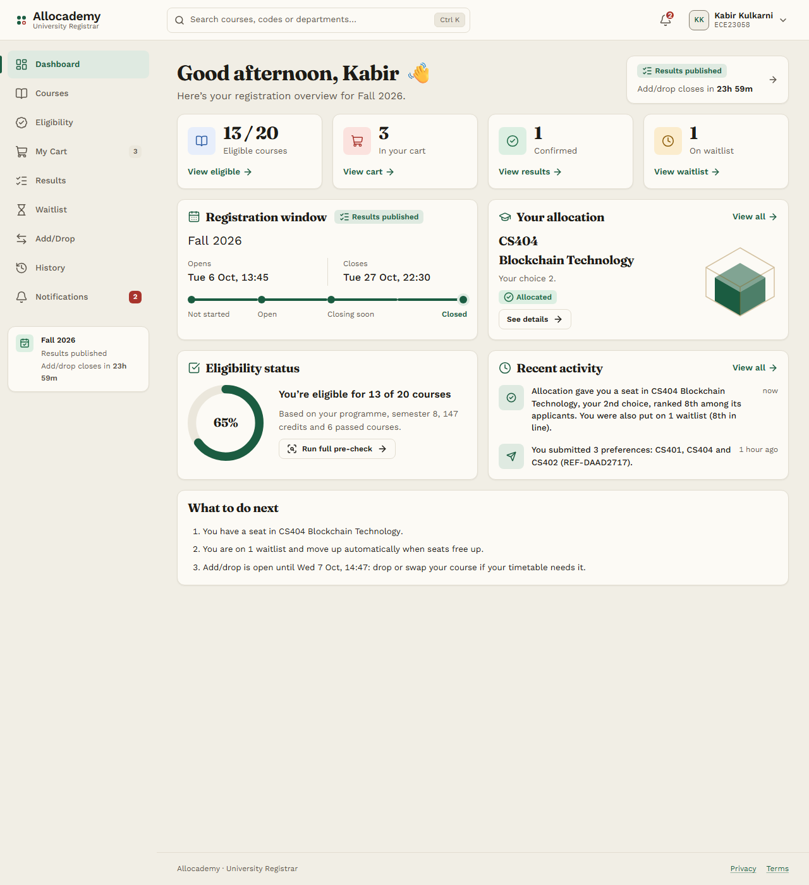

| Document                                                   | What it covers                                    |
| ---------------------------------------------------------- | ------------------------------------------------- |
| [docs/PROBLEM_STATEMENT.md](docs/PROBLEM_STATEMENT.md)     | The brief                                         |
| [docs/SPEC.md](docs/SPEC.md)                               | Scope, quality rules and conventions              |
| [docs/ALLOCATION.md](docs/ALLOCATION.md)                   | How seats are decided, and why it is fair         |
| [docs/CONCURRENCY.md](docs/CONCURRENCY.md)                 | The atomic submit, promotion and the seat race    |
| [docs/DATABASE.md](docs/DATABASE.md)                       | Schema, constraints and seed data                 |
| [docs/DESIGN.md](docs/DESIGN.md)                           | The visual system and every review round          |
| [docs/redesign/](docs/redesign/)                           | The three directions this design was chosen from  |
| [docs/DEMO.md](docs/DEMO.md)                               | A step-by-step script for demonstrating it        |
| [docs/javascript-concepts.md](docs/javascript-concepts.md) | Where the JavaScript and TypeScript concepts live |

---

## The problem

When registration opens, hundreds of students try to register in the same few
minutes. A first-come-first-served queue rewards whoever has the fastest
internet connection, not whoever most needs or deserves the seat — and when an
elective is oversubscribed, the leftovers get settled by informal appeals to
the department.

This platform replaces that with something a registrar can defend:

- **Speed stops mattering.** Submitting early gives no advantage. Every
  submitted cart is collected first, and seats are decided afterwards, once,
  for everybody at the same time.
- **The rules are fixed before anyone plays.** Opening registration **freezes**
  the allocation policy — the method, the weights, the priority points, the
  tie-break seed and the set of offered courses. They cannot be changed
  afterwards, and the database refuses the change even if the application is
  wrong.
- **Every student gets a reason.** Not "you didn't get in", but their own
  score, how it was made up, and the cut-off the last seat went at.
- **A past run can be proved.** Each run stores its own input; re-running that
  stored input through the same algorithm version must produce the same output
  hash.

On the demo data the difference is concrete: first-come-first-served leaves
**78** cases of justified envy — a student who wanted a course more and scored
higher than somebody who got it — while preference-and-priority leaves **0**.

---

## Features

All seven features in the brief are built, plus the account and course
management the platform needs to run on real data instead of a seed.

| #   | Feature                                        | Status   |
| --- | ---------------------------------------------- | -------- |
| 1   | Course catalogue with live seat counts         | **Done** |
| 2   | Eligibility pre-check before the window opens  | **Done** |
| 3   | Registration cart with atomic submit           | **Done** |
| 4   | Fair allocation for oversubscribed electives   | **Done** |
| 5   | Waitlist with automatic promotion              | **Done** |
| 6   | Add/drop                                       | **Done** |
| 7   | Registration status and history                | **Done** |
| +   | Accounts, student records and course catalogue | **Done** |

### 1. Course catalogue — `/student/courses`

Every course offered this term, with capacity, seats taken, seats left, how
many students have requested it and the demand ratio. For a student it also
shows whether they can take it and why.

Seat numbers refresh every 10 seconds while the tab is visible; a hidden tab
sends nothing. The poll sends the last `ETag` and gets an empty **304** back
when nothing has changed, and changed numbers flash briefly rather than the
page reloading. Search, department, credits, "eligible only" and "seats left"
filters and five sort orders all live in the URL, so a view can be shared or
refreshed. Cards or table, the reader's choice.

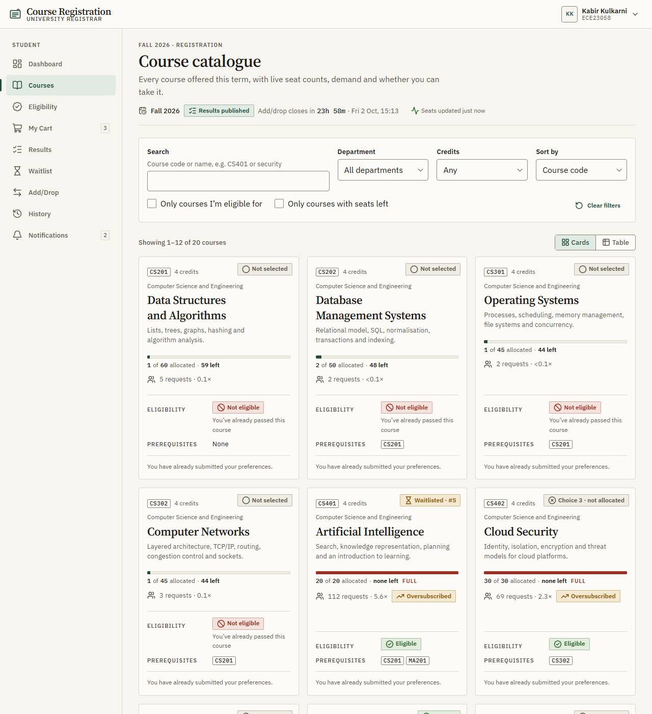

### 2. Eligibility pre-check — `/student/eligibility`

Every offered course checked against the student's own record — programme,
semester, credits and passed courses — with the record shown beside it, so they
can see exactly what the check judged them on. Ineligible courses list **every**
reason in plain English ("Needs semester 5 — you're in semester 4", "Complete
CS201 Data Structures first"), never just one.

It works while the window is still a draft. That is the whole point: find out
before registration opens, not after it closes.

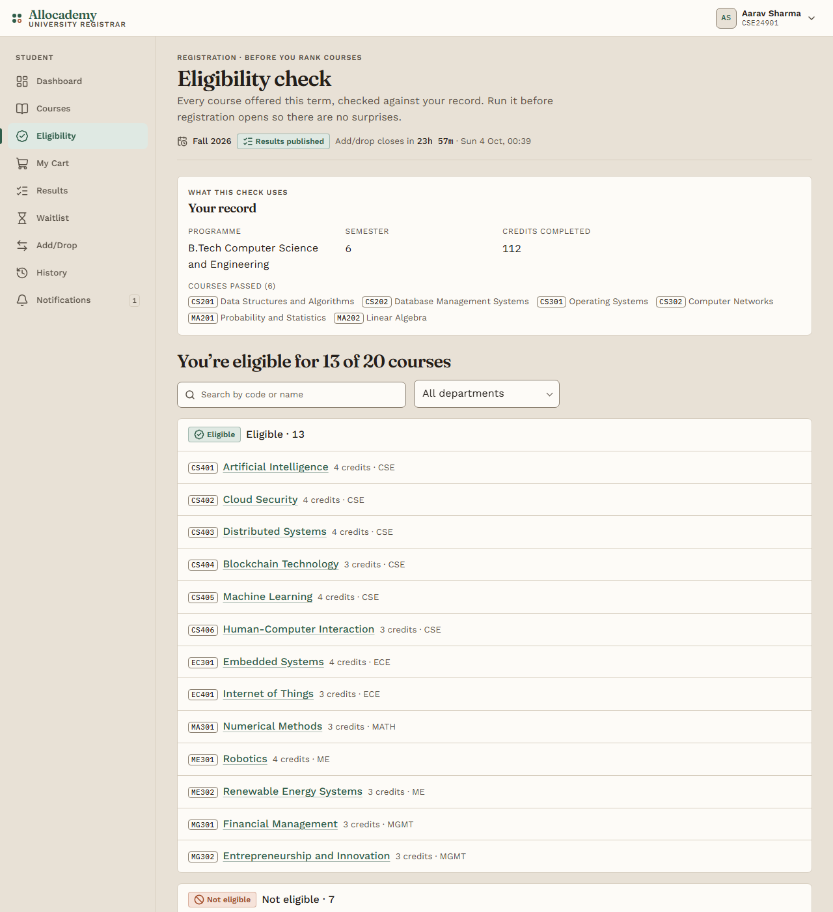

### 3. Registration cart — `/student/cart`

Add courses from the catalogue cards, the catalogue table or the course detail
page, then rank up to five with Move up / Move down. Drag-and-drop is an extra,
never the only way, and focus follows the moved item while a polite live region
announces its new position.

**Submitting is one transaction carrying an idempotency key.** The browser
generates one `crypto.randomUUID()` per attempt and reuses it for every retry,
so a dropped connection is always safe to retry and can never create a second
submission. There is no such thing as a half-submitted cart, and the arrival
number comes from a database sequence. Afterwards the page shows a receipt with
the reference, the time and the arrival number.

How that is guaranteed, with a sequence diagram:
[docs/CONCURRENCY.md](docs/CONCURRENCY.md).

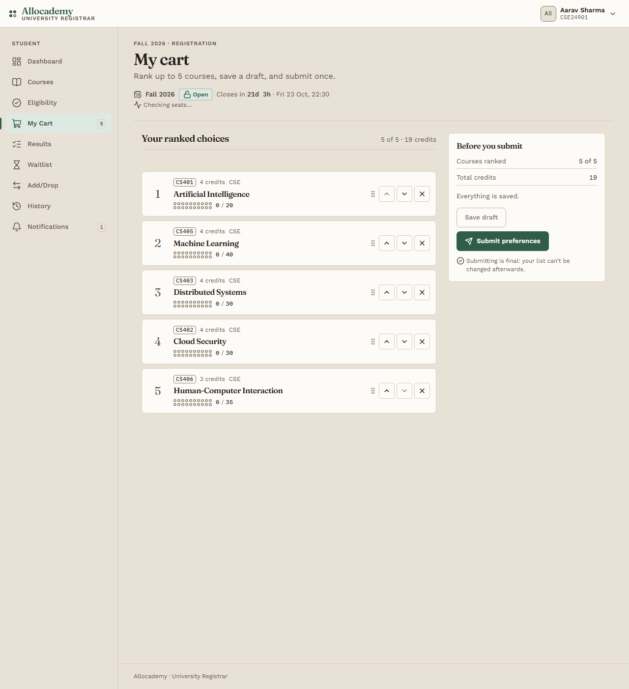

### 4. Allocation — `/admin/allocation-runs`, `/student/results`

Two methods behind one interface: **FCFS** (submission order) and
**Preference + Priority** (student-proposing deferred acceptance). **Preview**
runs both on a fresh snapshot and shows them side by side without writing
anything, so the registrar can see what each would do before committing.
**Run** is one transaction and can complete only once per window.

Students get a plain-English explanation for every course they ranked — their
score, what it was made of, and what the last seat went for — and never see
another student's data.

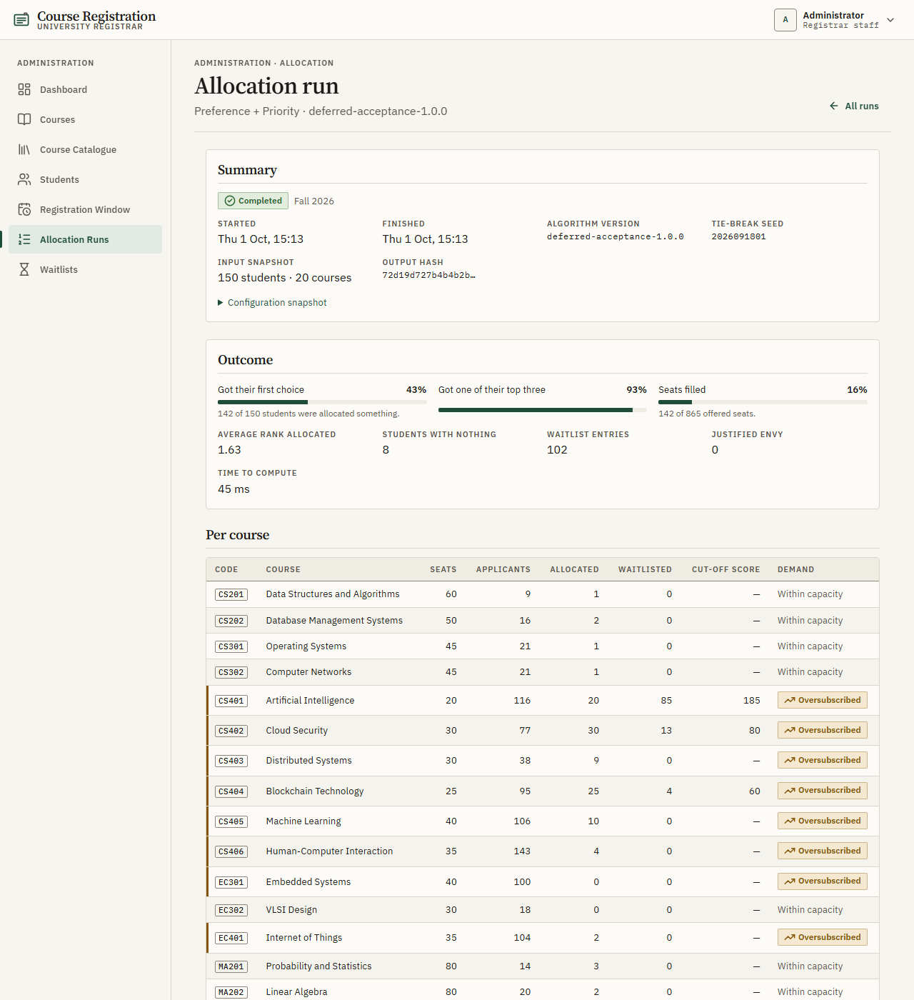
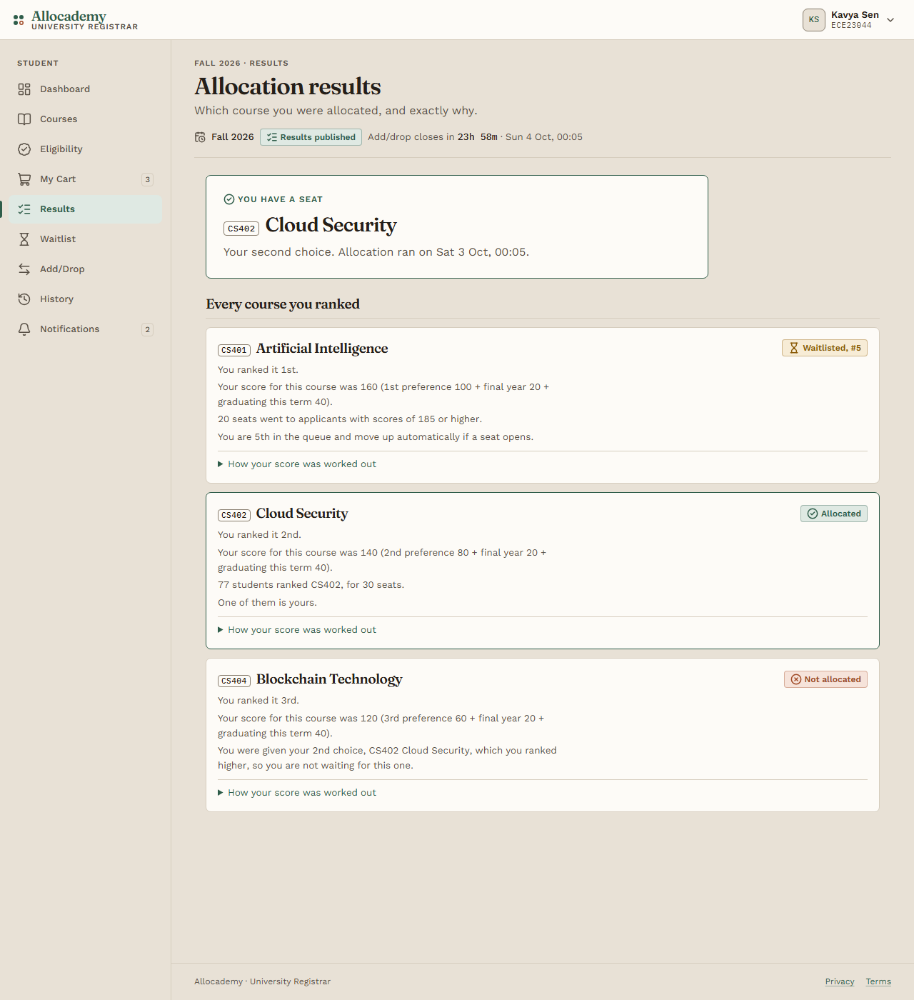

### 5. Waitlists — `/student/waitlist`, `/admin/waitlists`

A student who missed out is queued for every course they ranked above whatever
they got, so a promotion is always an **upgrade**, never a sideways move. When
a seat frees up, the next eligible student in that queue takes it — and the
seat they release frees in turn, which can cascade. It all happens inside the
transaction of whatever freed the first seat, so an action and the promotions
it caused commit together or not at all.

Positions are never renumbered: a student's place is computed over the entries
still waiting, so the queue stays honest as people leave it.

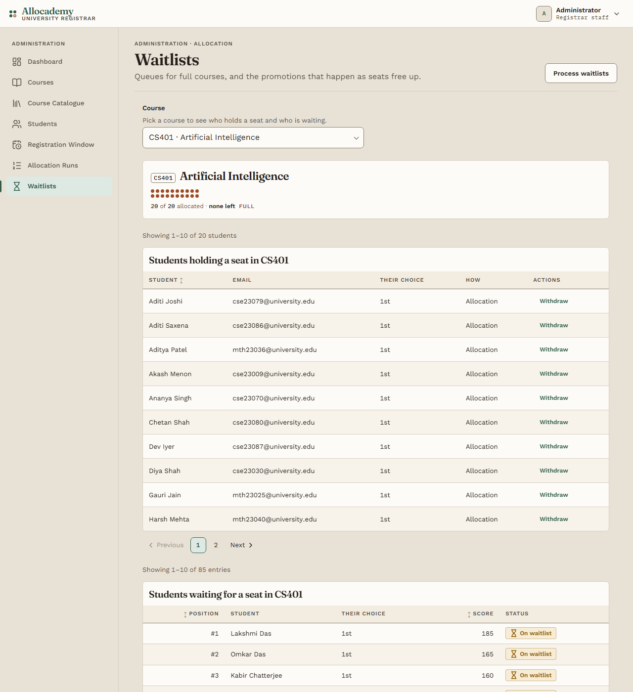

### 6. Add/drop — `/student/add-drop`

While the add/drop period is open, a student can drop their elective, add one
with a free seat, swap in a single step, or join and leave waitlists. Outside
the period every such request is refused by the server, and the button says why
rather than being greyed out with no explanation. A swap moves the seat in one
step: if the new course fills up first, the student keeps the one they have.

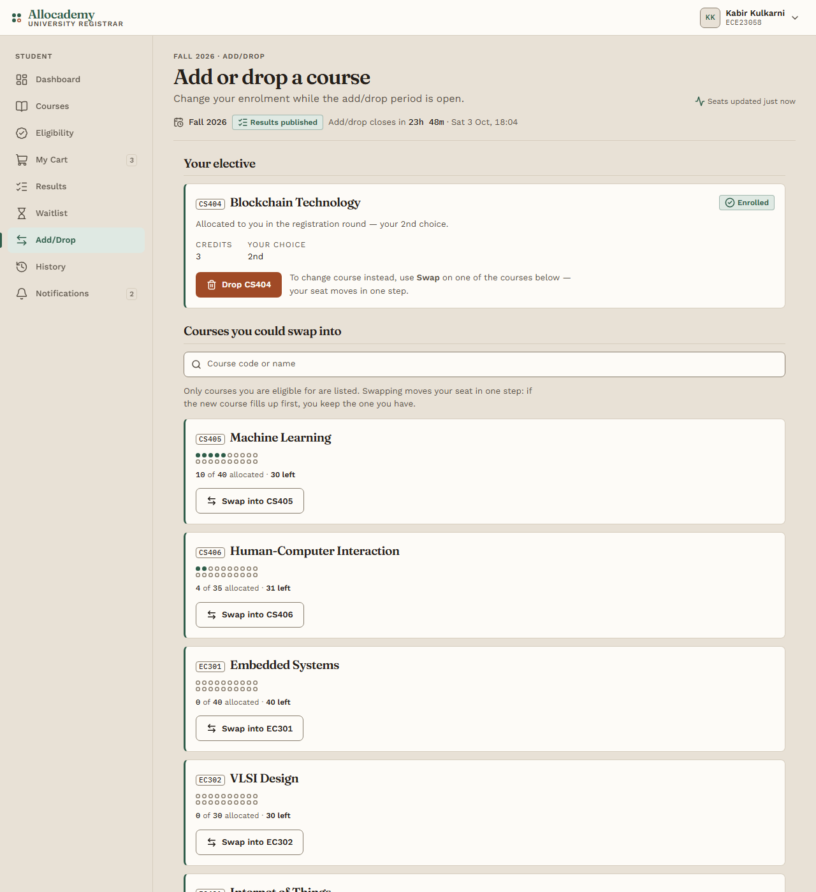

### 7. Status and history — `/student/history`, `/student/notifications`

Where the student stands right now, and the whole timeline that got them there:
submitted, allocated, waitlisted, promoted, added, dropped. Events carry
structured facts, not prebuilt sentences, so the wording lives in one place on
the client and can change without rewriting history.

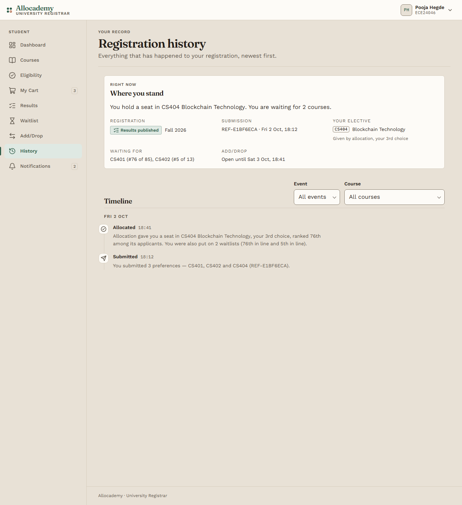

### Accounts, records and the course catalogue

**Administrators create student accounts; students never self-register**, and
never edit their own academic data — it is what eligibility and priority are
judged on, so it belongs to the registrar. A student activates their account
from an e-mailed, single-use link. Courses and their rules are maintained at
`/admin/course-catalogue`, by hand or from a CSV in a preview-then-confirm
flow. Nothing is ever deleted: an account is deactivated, a course is retired,
and every submission, enrolment and result keeps pointing at a row that still
exists.

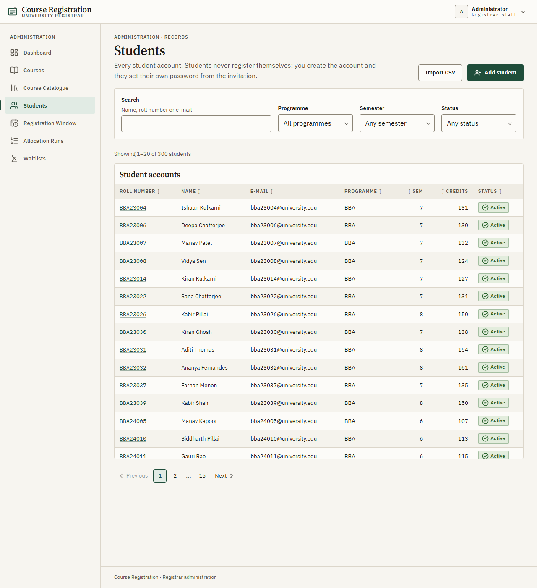
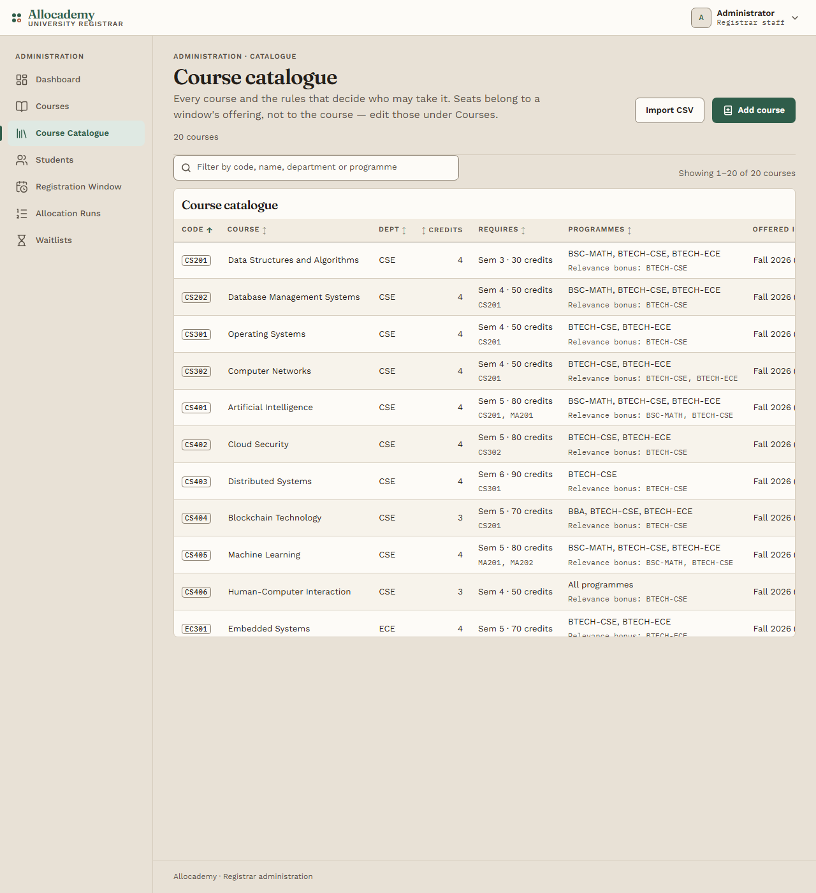

### Co-administrators

A registrar's office is more than one person, so **`/admin/team`** invites a
**co-administrator**: somebody who runs registration day to day with every
power an administrator has, except creating, inviting, deactivating or
reactivating a member of staff. That single exception is what stops the role
from being a way to grant itself more.

They are invited by name and address, set their own password from a single-use
link exactly as a student does, and are deactivated rather than deleted, which
signs them out at once and keeps every audit row they wrote. The last active
administrator cannot be deactivated, because somebody has to be able to invite
the next one.

The Team page and its navigation item are shown only to an administrator, but
that is a courtesy: `/api/admin/team` is the one router behind
`requireAdminManager`, and it answers `403` to a co-administrator whatever the
interface does.

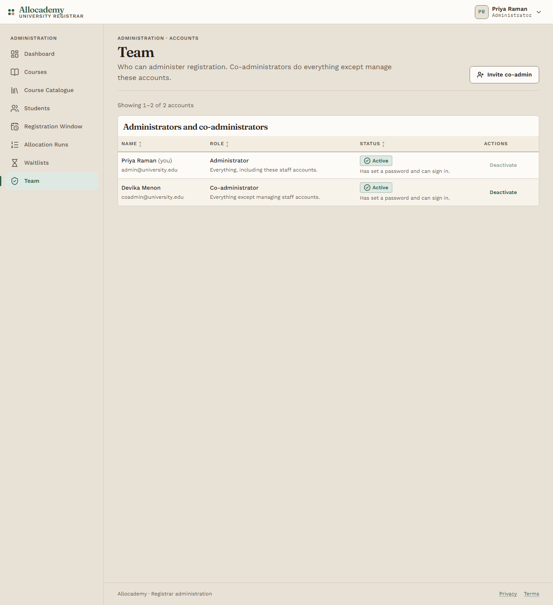

---

## Design

**A warm academic catalogue, not a dashboard.** Finding out what you can take
and whether there is room is a reading task before it is a control task, so the
interface is built like a catalogue: clay around warm paper, forest green as the
one colour you have to learn, and ruled entries rather than a grid of boxed
cards. Terracotta means "you cannot have this" and nothing else; amber means
"not yet".

**Fraunces** carries the voice on its optical-size axis — a 40px page title and
a 13px course code are drawn differently rather than scaled — with **Work Sans**
for the interface and **IBM Plex Mono** kept for the things that align by the
character. Both are self-hosted variable fonts; there is no Tailwind, no CSS
framework and no inline styles, only hand-written CSS Modules over the tokens in
[`variables.css`](frontend/src/styles/variables.css).

**The seat count gets a drawing as well as a number**: a twenty-dot matrix,
filled = taken, the same size on every course whatever its capacity, with the
exact figures beside it. Nothing is ever carried by colour alone — every status
is an icon plus words, and every meter prints its numbers.

[`node frontend/src/styles/contrast.mjs`](frontend/src/styles/contrast.mjs)
reads the tokens straight out of the stylesheet and checks all 48 pairs across
both themes against WCAG AA, 4.5:1 for text and 3:1 for borders. It exits
non-zero on a failure, so the palette cannot quietly drift.

**A colour either carries a labelled key or it does not appear.** There are no
decorative left stripes: an earlier draft hashed each department to one of five
tones, and it went, because nothing on the page told a reader what plum meant.
What is left is states with words beside them. Hover tells you a thing is
interactive and stops there, nothing lifts or glows, and the interface copy has
no em dashes in it (the one in a table cell is a value meaning "none").

Privacy and Terms are written in plain English and linked from every footer.
Both say up front that they are a template: the data controller, the retention
period, the applicable law and the complaints route are the university's to
fill in.

The full system, the reasoning behind each of those decisions, the dark theme
and every review round: [docs/DESIGN.md](docs/DESIGN.md). The two directions it
was chosen over: [docs/redesign/](docs/redesign/).


---

## Architecture

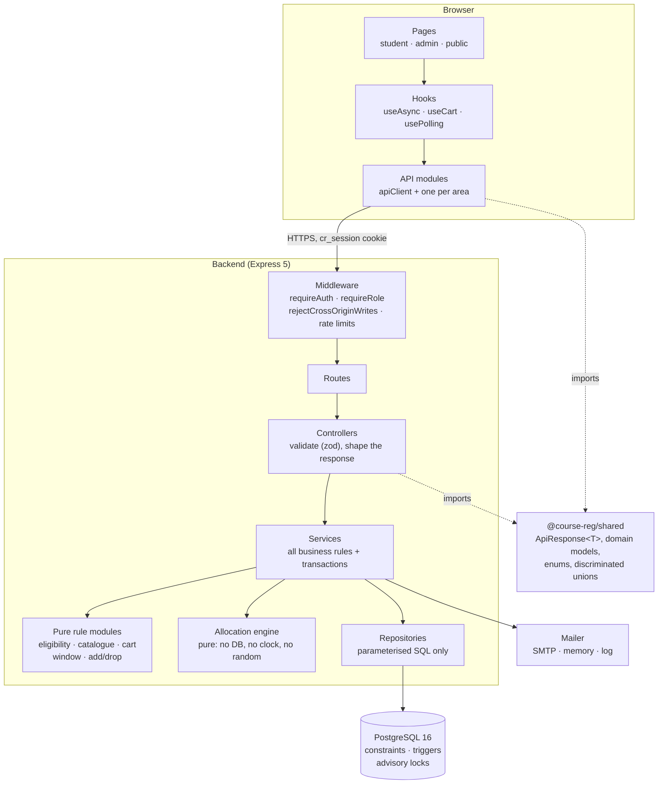
```mermaid
flowchart TB
    subgraph browser["Browser"]
        pages["Pages<br/>student · admin · public"]
        hooks["Hooks<br/>useAsync · useCart · usePolling"]
        apimod["API modules<br/>apiClient + one per area"]
        pages --> hooks --> apimod
    end

    shared["@course-reg/shared<br/>ApiResponse&lt;T&gt;, domain models,<br/>enums, discriminated unions"]

    subgraph api["Backend (Express 5)"]
        mw["Middleware<br/>requireAuth · requireRole<br/>rejectCrossOriginWrites · rate limits"]
        routes["Routes"]
        controllers["Controllers<br/>validate (zod), shape the response"]
        services["Services<br/>all business rules + transactions"]
        pure["Pure rule modules<br/>eligibility · catalogue · cart<br/>window · add/drop"]
        engine["Allocation engine<br/>pure: no DB, no clock, no random"]
        repos["Repositories<br/>parameterised SQL only"]
        mw --> routes --> controllers --> services
        services --> pure
        services --> engine
        services --> repos
    end

    db[("PostgreSQL 16<br/>constraints · triggers<br/>advisory locks")]
    mail["Mailer<br/>SMTP · memory · log"]

    apimod -- "HTTPS, cr_session cookie" --> mw
    repos --> db
    services --> mail
    apimod -. imports .-> shared
    controllers -. imports .-> shared
```

**The rules that keep it that shape:**

- **Layers go one way.** Routes → controllers → services → repositories. There
  is no SQL in a controller and no business logic in one; there is no `fetch`
  in a React component.
- **One contract, both sides.** `shared/` holds the API types, so a renamed
  field is a compile error rather than a runtime surprise. It is consumed as
  TypeScript source in development and as a compiled build in production.
- **PostgreSQL is the source of truth**, not a place to store what the
  application already decided. Capacity, status values, uniqueness and the
  frozen policy are enforced by constraints and triggers, so the database
  refuses a bad write even if the application asks for one.
- **The rules are pure and tested without a database.** Eligibility, catalogue,
  cart, window, add/drop and the whole allocation engine are functions of their
  input.
- **Authorization is server-side, always.** Seat counts, eligibility, identity
  and priority coming from a browser are never trusted.

```text
.
├── backend/    Express API (routes → controllers → services → repositories)
│   ├── src/allocation/   the pure allocation engine
│   ├── src/database/     migrations, transactions, seed
│   └── tests/            integration tests against a real PostgreSQL
├── frontend/   React SPA (components → hooks → api)
│   ├── src/components/   the component library
│   ├── src/pages/        one folder per area
│   └── src/styles/       reset, tokens, base
├── shared/     Types shared by both sides
├── docs/       Specification, design, allocation, concurrency, demo
├── docker/     PostgreSQL init scripts (creates the test database)
├── scripts/    The documentation screenshot runner
├── docker-compose.yml        Development stack (hot reload)
└── docker-compose.prod.yml   Production-like stack (nginx on :8080)
```

---

## Tech stack

| Part                        | Used for                                                                                             |
| --------------------------- | ---------------------------------------------------------------------------------------------------- |
| **React 19**                | The whole UI. Function components and hooks only — no class components, no state library needed      |
| **TypeScript 5.9**          | Everywhere, `strict` plus `noUncheckedIndexedAccess`. `any` is a lint error                          |
| **Vite 6**                  | Dev server with hot reload, and the production build with route-level code splitting                 |
| **React Router 7**          | Routing, lazy route chunks, and the layout routes that guard student and admin areas                 |
| **CSS Modules + CSS3**      | All styling, hand-written. Design tokens as custom properties; no Tailwind, no CSS-in-JS             |
| **Fraunces + Work Sans**    | Self-hosted variable fonts. Fraunces carries the display voice on its optical-size axis              |
| **Node 20.12+**             | The backend runtime (developed on 20, verified on 22 and 24)                                         |
| **Express 5**               | HTTP, middleware, routing                                                                            |
| **PostgreSQL 16**           | The source of truth: constraints, triggers, transactions, `FOR UPDATE`/`FOR SHARE`, advisory locks   |
| **`pg`**                    | The database driver. Parameterised SQL only — no ORM, so the SQL is visible and reviewable           |
| **zod**                     | Validating every request body and query at the boundary, where `unknown` becomes a typed value       |
| **jsonwebtoken + bcryptjs** | The session cookie and password hashing                                                              |
| **nodemailer**              | Invitation and password-reset e-mail                                                                 |
| **Mailpit**                 | Catches every e-mail in development so the flows can be demonstrated                                 |
| **Vitest**                  | Every test, in all three workspaces                                                                  |
| **React Testing Library**   | Component and page tests, driven the way a user drives the UI                                        |
| **axe-core**                | An accessibility check on every page and component                                                   |
| **supertest**               | Integration tests through the real Express app against a real database                               |
| **fast-check**              | Property-based tests for allocation and waitlist promotion                                           |
| **ESLint (type-aware)**     | `strictTypeChecked` + `stylisticTypeChecked`, plus a11y and React Hooks rules; zero warnings allowed |
| **Prettier**                | Formatting, checked in CI-style with `format:check`                                                  |
| **Docker + Compose**        | The whole stack, development and production-like                                                     |

---

## Running it

### With Docker (recommended)

Requires Docker Desktop, or Docker Engine with Compose v2.

```bash
cp .env.example .env          # then change POSTGRES_PASSWORD, DATABASE_URL and JWT_SECRET
npm run docker:up             # docker compose up --build -d
npm run docker:demo:reset -- --stage=open
```

| URL                              | What                                            |
| -------------------------------- | ----------------------------------------------- |
| http://localhost:5173            | The app (Vite, hot reload)                      |
| http://localhost:4000/api/health | Backend health (API + database)                 |
| http://localhost:8025            | **Mailpit** — every invitation and reset e-mail |
| localhost:5432                   | PostgreSQL                                      |
| localhost:1025                   | Mailpit's SMTP, which the backend sends through |

The backend waits for PostgreSQL to be healthy, applies migrations, then starts
with hot reload. Source folders are bind-mounted; `node_modules` live in named
volumes so host and container dependencies never mix. File watching uses
polling, so hot reload works on Windows and macOS bind mounts.

**Sending real e-mail instead.** Every mail setting comes from `.env`, and with
none of them set the stack talks to Mailpit exactly as above. Point `SMTP_HOST`,
`SMTP_PORT`, `SMTP_USER`, `SMTP_PASSWORD`, `MAIL_FROM` and `MAIL_FROM_NAME` at a
real relay — Brevo is `smtp-relay.brevo.com` on port 587 with `SMTP_SECURE=false`,
since 587 upgrades with STARTTLS — and the same code delivers for real.
`.env.example` has the block commented out, ready to fill in. Whenever a user and
password are set the backend **requires** the connection to be encrypted before
sending them, so a relay that stopped offering STARTTLS fails the send rather
than leaking the credential. The line the backend logs at startup says which
server it chose and whether the connection will be encrypted.

| Script                        | Does                                                |
| ----------------------------- | --------------------------------------------------- |
| `npm run docker:up`           | Build and start the dev stack in the background     |
| `npm run docker:logs`         | Follow the logs                                     |
| `npm run docker:down`         | Stop it (keeps the data)                            |
| `npm run docker:reset`        | Stop and **delete the volumes** (database, modules) |
| `npm run docker:prod`         | Build and start the production stack on :8080       |
| `npm run docker:prod:down`    | Stop the production stack                           |
| `npm run docker:admin:create` | Create an administrator account interactively       |

After changing dependencies, refresh the `node_modules` volumes with
`npm run docker:reset && npm run docker:up`.

**Production stack:** `npm run docker:prod`, then open http://localhost:8080.
nginx serves the built frontend and proxies `/api` to the backend; only port
8080 is published. It starts with an empty database plus the migrations — the
seed and every demo script refuse to run there, with no override — so the first
administrator is created with `npm run admin:create`.

### Without Docker

Requires Node.js ≥ 20.12 and a PostgreSQL 16 server.

```bash
cp .env.example .env    # point DATABASE_URL at your PostgreSQL
npm install
npm run migrate
npm run seed            # optional demo data
npm run dev             # backend on :4000, frontend on :5173
```

`docker compose up -d postgres` runs just the database in Docker if that is
easier. Without `SMTP_HOST` set, account e-mails are written to the backend log
with the link included, so the invitation and reset flows still work.

---

## Demo accounts and demo stages

> **Demo-only credentials.** They are documented **here and nowhere else** —
> the sign-in page is the form and nothing else, so no build of the app
> displays them. Never reuse them anywhere real.

> **These are the passwords a LOCAL stack is seeded with.** On the live site
> the two staff passwords were rotated to random ones immediately after
> seeding, because `admin@university.edu` can edit every student and run the
> allocation, and a password printed in a public README must not open it. The
> student accounts are the same there as here. See
> [Deployment](#deployment).

| Role     | E-mail                        | Password      | Situation                                                                                        |
| -------- | ----------------------------- | ------------- | ------------------------------------------------------------------------------------------------ |
| Admin    | `admin@university.edu`        | `Admin@123`   | Everything, including the Team page                                                              |
| Co-admin | `coadmin@university.edu`      | `CoAdmin@123` | Everything except the Team page: no nav item, and the endpoints answer 403                       |
| Student  | `aarav.sharma@university.edu` | `Student@123` | CSE, semester 6. Eligible for AI (programme relevance +25). **No submission** — use for the cart |
| Student  | `priya.nair@university.edu`   | `Student@123` | ECE, semester 5. Eligible for AI, no priority bonus. **No submission**                           |
| Student  | `meera.iyer@university.edu`   | `Student@123` | Mechanical, semester 3. **Not** eligible for AI                                                  |
| Student  | `rohan.verma@university.edu`  | `Student@123` | CSE, final year, graduating this term: the highest priority (+20 +25 +40)                        |

The other 296 generated students also use `Student@123`; their e-mail is their
roll number, e.g. `cse24004@university.edu`.

### Demo stages

One command puts the database in any state you want to demonstrate:

```bash
npm run docker:demo:reset -- --stage=draft      # base seed; the window is not open yet
npm run docker:demo:reset -- --stage=open       # + ~150 submissions
npm run docker:demo:reset -- --stage=closed     # + registration closed
npm run docker:demo:reset -- --stage=allocated  # + a real allocation run
npm run docker:demo:reset -- --stage=add-drop   # + the add/drop period open
```

Each stage is cumulative and goes through the **real service**, never a
shortcut `UPDATE`: closing freezes the policy and notifies every student, and
allocating runs the same transaction the admin's button runs. Outside Docker,
`npm run demo:reset -- --stage=...`. It refuses to run in production.

The seed deliberately leaves **aarav.sharma** and **priya.nair** without a
submission, so the cart and the atomic submit can be demonstrated live rather
than described. It also sets up the headline case: **Artificial Intelligence**,
20 seats, 112 requests.

### Proving the concurrency guarantees

```bash
npm run docker:demo:concurrent-submit                 # 50 students, default
npm run docker:demo:concurrent-submit -- --students=100
npm run docker:demo:seat-race                         # 100 students, 10 seats
npm run docker:demo:seat-race -- --students=200 --seats=20
```

The first fires every student's submit **twice at the same instant with the
same idempotency key**, then checks the database and prints PASS/FAIL for
duplicates, partial carts, one submission per student, and unique gap-free
arrival numbers. The second prepares a course with exactly N free seats and
fires one "add, or join the waitlist if full" per student simultaneously, then
reports enrolled, waitlisted, overbooked, duplicate enrolments and whether the
waitlist positions are unique and consecutive. Both are explained in
[docs/CONCURRENCY.md](docs/CONCURRENCY.md).

A full walkthrough to demonstrate the project is
[docs/DEMO.md](docs/DEMO.md).

---

## How allocation works

The short version; the rule book, the worked example and the fairness argument
are in [docs/ALLOCATION.md](docs/ALLOCATION.md).

Only **submitted** carts take part, and each student gets **at most one**
elective from their ranked list — one they ranked, are still eligible for
(re-checked from the database at allocation time, never trusted from when the
cart was saved), and that the window offers.

**Preference + Priority** gives each student a score **per course**:

```
score = preference weight  (1st 100 · 2nd 80 · 3rd 60 · 4th 40 · 5th 20)
      + final year         (+20)
      + programme relevance(+25)
      + graduation urgency (+40)
```

Ties are broken by one seeded number per student, drawn once, so the ordering
is stable and the run is repeatable. Seats are then assigned by
**student-proposing deferred acceptance**: every student applies to their top
choice, each course provisionally keeps its highest scorers up to capacity and
releases the rest, and the released students apply to their next choice. It
settles because every rejection moves a student strictly down their own list.

The result is **no justified envy**: nobody is left wanting a course more than
somebody who got it while also scoring higher for it. **FCFS** is implemented
too, purely so the two can be compared on the same data — on the demo seed it
leaves 78 such cases against 0.

Each run then writes its input snapshot, and
`POST /api/admin/allocation-runs/:id/verify` re-runs **that stored input**
through the same algorithm version and compares output hashes. Rebuilding the
input from today's database would prove nothing, which is why it does not.

---

## API overview

Every endpoint answers `ApiResponse<T>` — `{ success, data, message? }`.
Student endpoints live under `/api/students/me/...` and take the student's
identity from the session cookie, never from the URL or the body.

**Authentication and accounts**

| Endpoint                          | Access    | Purpose                                                            |
| --------------------------------- | --------- | ------------------------------------------------------------------ |
| `POST /api/auth/login`            | public    | Sign in; sets the session cookie                                   |
| `POST /api/auth/logout`           | public    | Clears it                                                          |
| `GET /api/auth/me`                | signed in | The current user                                                   |
| `GET /api/auth/activation/:token` | public    | Is this link usable? Spent, expired and unknown are **one** answer |
| `POST /api/auth/activate`         | public    | Sets the first password and signs in                               |
| `POST /api/auth/forgot-password`  | public    | The same answer whether or not the address exists                  |
| `POST /api/auth/reset-password`   | public    | Replaces the password and signs every other device out             |
| `PUT /api/account/password`       | signed in | Change password, either role                                       |

**Catalogue and eligibility**

| Endpoint                                | Access    | Purpose                                                      |
| --------------------------------------- | --------- | ------------------------------------------------------------ |
| `GET /api/registration-windows/current` | signed in | The window, plus the **server's** time                       |
| `GET /api/courses`                      | signed in | The catalogue: search, filters, sort, paging                 |
| `GET /api/courses/:code`                | signed in | One course in full, prerequisites met or not                 |
| `GET /api/courses/seats`                | signed in | Seat numbers only, with an `ETag`; `If-None-Match` → **304** |
| `GET /api/eligibility`                  | student   | Every offered course checked against the caller              |

**The cart, allocation and waitlists**

| Endpoint                                     | Access  | Purpose                                                        |
| -------------------------------------------- | ------- | -------------------------------------------------------------- |
| `GET` / `PUT /api/preferences`               | student | Read and save the draft cart in rank order                     |
| `POST /api/registration/submit`              | student | One atomic submit; needs an idempotency key                    |
| `POST /api/admin/allocation/preview`         | admin   | Both methods on a fresh snapshot. Writes nothing               |
| `POST /api/admin/allocation/run`             | admin   | `CLOSED → ALLOCATED`, once per window                          |
| `POST /api/admin/allocation-runs/:id/verify` | admin   | Re-runs the stored snapshot and compares hashes                |
| `GET /api/allocation/results`                | student | The caller's own outcome and the reasoning behind it           |
| `GET /api/students/me/waitlist`              | student | The caller's own queues, with live positions                   |
| `POST /api/admin/enrollments/:id/withdraw`   | admin   | Releases a seat and promotes whoever is next, cascade included |
| `POST /api/admin/waitlists/process`          | admin   | The safety sweep: offers every free seat to its waitlist       |

**Add/drop and the student's record**

| Endpoint                             | Access  | Purpose                                   |
| ------------------------------------ | ------- | ----------------------------------------- |
| `POST /api/students/me/add-drop/...` | student | Add, drop, swap, join or leave a waitlist |
| `GET /api/students/me/status`        | student | Where they stand now                      |
| `GET /api/students/me/history`       | student | Their timeline, newest first              |
| `GET /api/students/me/notifications` | student | Their messages, with read and read-all    |

**Administration**

| Endpoint                                                       | Access | Purpose                                                    |
| -------------------------------------------------------------- | ------ | ---------------------------------------------------------- |
| `GET` / `PATCH /api/admin/registration-window`                 | admin  | The window and its policy. `DRAFT` only: `409` once frozen |
| `POST /api/admin/registration-window/open` and `/close`        | admin  | Freeze the policy and notify everyone, then close          |
| `GET /api/admin/courses`                                       | admin  | Offerings with seats, demand and an oversubscribed flag    |
| `PATCH /api/admin/courses/:code/capacity`                      | admin  | `409` below the allocated seats; audited                   |
| `GET`/`POST`/`PATCH /api/admin/course-catalogue`               | admin  | Course records and their rules; retire and reinstate       |
| `GET`/`POST`/`PATCH /api/admin/students`                       | admin  | Student accounts; invite, deactivate, reactivate           |
| `POST /api/admin/{students,course-catalogue}/import[/preview]` | admin  | CSV import: preview judges, confirm re-judges and writes   |

---

## Security

- **Sessions are an httpOnly cookie.** `cr_session` holds an HS256 JWT (user id
  - role, 8 hours), `SameSite=Strict`, `Path=/api`, `Secure` in production. The
    token never appears in a response body, in `localStorage` or in reach of
    JavaScript.
- **Authorization is re-checked on every request.** The cookie is verified and
  the user re-loaded from the database; `requireAdmin` answers `403` for anyone
  who is not staff. A student's identity always comes from the session, and the
  session's role is carried through from the row rather than re-asserted.
- **Three roles, and one difference between two of them.** A `CO_ADMIN` does
  everything an `ADMIN` does — students, imports, courses, the registration
  window, allocation, waitlists, add/drop — except create, invite, deactivate
  or reactivate a member of staff. That is enforced by `requireAdminManager` on
  the `/api/admin/team` router alone; no request body anywhere can set a role,
  and the last active administrator cannot be deactivated. Audit rows name the
  actual actor, so a co-administrator's actions are attributed to them.
- **No account enumeration.** An unknown e-mail and a wrong password give the
  same `401`, and both run a bcrypt comparison so the timing matches.
  `/forgot-password` answers identically for a known and an unknown address —
  same status, same body, even when sending fails — and its rate limiter is
  keyed on the IP **alone**, because keying it on the e-mail would make the
  limiter itself the oracle the endpoint refuses to be.
- **Links are stored as hashes.** Only the SHA-256 of an activation or reset
  token reaches the database, so a leaked table cannot be turned back into
  working links. Unknown, spent and expired are one answer. Redeeming one is a
  transaction over a locked row, so two requests carrying the same link cannot
  both succeed.
- **Changing a password ends every other session**, by comparing
  `users.password_changed_at` with each token's `iat`; the device that made the
  change gets a fresh cookie in the same response.
- **Brute force and abuse are rate limited:** failed sign-ins per IP and
  e-mail, the public account endpoints per IP, and submits and add/drop
  changes per signed-in student.
- **CSRF:** `SameSite=Strict`, and state-changing requests arriving with a
  foreign `Origin` are rejected with `403`.
- **SQL injection:** parameterised statements only. No value is ever
  interpolated into a statement, anywhere.
- **The client is never trusted** for seat counts, eligibility, identity or
  priority. Every one is recomputed on the server from its own rows.
- **Admin actions are audited.** Every create, edit, import, invitation,
  deactivation, retirement, capacity change, window transition and allocation
  run writes an `audit_logs` row with its old and new values. Admin sign-ins
  are recorded too.
- **Nothing is deleted.** Accounts deactivate, courses retire. Every historical
  row keeps pointing at something that still exists.

`JWT_SECRET` must be at least 32 characters, and the server refuses to start in
production with the example value. `.env` is gitignored; `.env.example`
documents every setting and contains no secret.

---

## Testing

```bash
npm run lint           # ESLint, zero warnings allowed
npm run typecheck      # tsc --noEmit in every workspace
npm run test           # Vitest in all three workspaces
npm run build          # shared → backend → frontend
npm run format:check   # Prettier
```

| Workspace   | Files   | Tests    | What                                                                                                                                  |
| ----------- | ------- | -------- | ------------------------------------------------------------------------------------------------------------------------------------- |
| `shared/`   | 4       | 19       | Contracts, type guards, domain rules                                                                                                  |
| `backend/`  | 41      | 636      | Pure rules, the allocation engine, property-based tests, and integration tests through the real Express app against a real PostgreSQL |
| `frontend/` | 59      | 443      | Components, hooks, pages and utilities with React Testing Library, plus an axe check on each                                          |
| **Total**   | **104** | **1098** |                                                                                                                                       |

The backend integration tests need PostgreSQL running (`npm run docker:up`).
They use a separate `<db>_test` database, never the development one, and
truncate it between tests. They cover the things only a real database can
prove: that the atomic submit is atomic, that a fault injected mid-allocation
rolls back every table, that concurrent promotions do not deadlock or
double-book, and that the constraints refuse what they should.

Vitest runs at most 2 workers per workspace; raise it with
`VITEST_MAX_WORKERS=<n>` on a machine with memory to spare.

---

## Deployment

**Live: <https://allocademy.vercel.app>**

One Vercel project serves both halves, which is not a convenience: the session
cookie is `SameSite=Strict`, so the page and the API it calls have to share an
origin. A second domain for the API would mean giving that up.

```
                    https://allocademy.vercel.app
                                 |
            +--------------------+--------------------+
            |                                         |
   frontend/dist (static)                   api/index.ts (function)
   the built Vite bundle,                   the SAME createApp factory the
   SPA fallback to index.html               Docker server and the tests use
                                                      |
                                        Supabase Postgres, ap-south-1
                                        transaction pooler, port 6543
```

- **Region.** The function runs in `bom1` (Mumbai) and the database is in
  `ap-south-1` (Mumbai), so a query crosses a city rather than an ocean:
  `/api/health` reports single-digit milliseconds to the database once warm.
- **One function, not many.** `vercel.json` rewrites `/api/*` to `api/index.ts`,
  which exports the Express app — an app is already a `(req, res)` handler. The
  backend is not forked, so nothing about authorization, allocation or the
  cart can be true in one deployment and false in the other.
- **Connections.** Every concurrent invocation is a separate instance with its
  own pool, so `DATABASE_POOL_MAX` is **1** and Supabase's transaction pooler
  does the real multiplexing. The free Nano compute allows 200 client
  connections in total; ten per instance would exhaust that long before the
  traffic justified it.
- **Preview deployments are disabled**, and every environment variable is set
  for Production only. A preview could therefore never reach the live
  database even if one were created.

### Redeploying

Pushing to `main` deploys automatically once the repository is connected. By
hand, from a clean checkout:

```bash
npx vercel deploy --prod
```

Migrations are **not** run by the deployment: the live database is changed
deliberately, from a machine that has the credentials, over the **session**
pooler (port 5432).

```bash
DATABASE_URL="$PRODUCTION_DATABASE_URL" DATABASE_SSL=true npm run migrate -w backend
```

That distinction matters. The migration runner takes a _session-scoped_
`pg_advisory_lock` so two runners cannot apply the same file twice, and a
session lock is exactly what transaction pooling cannot keep. Everything the
app does at runtime uses `pg_advisory_xact_lock`, which is released at commit
and is safe through the pooler. `npm run check:pooler` proves all of it against
the live database — atomic rollback, `SELECT ... FOR UPDATE` blocking a second
writer, the advisory lock excluding a second holder, being released at `COMMIT`
and leaving nothing behind on a pooled connection.

### Environment variables

Set on Vercel for **Production only**, by name (values live in Vercel and in a
local `.env`, never in the repository):

| Variable                                                              | Why                                                     |
| --------------------------------------------------------------------- | ------------------------------------------------------- |
| `DATABASE_URL`                                                        | Supabase **transaction** pooler, port 6543              |
| `DATABASE_SSL`                                                        | `true`; Supabase refuses plaintext                      |
| `DATABASE_POOL_MAX`                                                   | `1`, one connection per function instance               |
| `JWT_SECRET`                                                          | Generated for production; unrelated to any local secret |
| `APP_BASE_URL`, `CORS_ORIGIN`                                         | The live origin; activation links are built from it     |
| `TRUST_PROXY_HOPS`                                                    | `1`, so the rate limiters see the real client IP        |
| `SMTP_HOST`, `SMTP_PORT`, `SMTP_SECURE`, `SMTP_USER`, `SMTP_PASSWORD` | The Brevo relay                                         |
| `MAIL_FROM`, `MAIL_FROM_NAME`                                         | The sender Brevo has verified                           |
| `LOG_LEVEL`                                                           | `info`                                                  |

`NODE_ENV` is `production` on Vercel already, which is what turns on secure
cookies and makes the app refuse to start without a mail server or with the
example JWT secret.

### What is weaker in production than in Docker

- **Rate limiting is per instance.** `express-rate-limit` keeps its counters in
  memory, and a serverless deployment has several instances, so the real limit
  is the configured one multiplied by however many are warm. It still stops a
  single client hammering one instance, and the expensive paths are protected
  by the database besides — but it is not the global limit the Docker
  deployment gets. **The fix is a shared store**: `@upstash/ratelimit` against
  Upstash Redis, which has a free tier and is the one dependency this would be
  worth adding.
- **Supabase's free tier pauses a project after about a week of inactivity.**
  The site then answers but `/api/health` reports the database unreachable
  until the project is resumed from the Supabase dashboard, which takes a
  minute and loses nothing. For a demo that is checked occasionally, this is
  the thing most likely to look like a bug and is not one.
- **Cold starts.** The first request to an idle instance pays for the pool and
  the module graph, a second or so. Nothing is kept warm deliberately.

### Demo data on the live site

The demo dataset is loaded **from a developer machine**, never by the app:
`demo:reset` refuses to run with `NODE_ENV=production`, and that guard stays.

The student accounts keep the password published above — they are the point of
the demo and can only ever see their own record. **The two staff accounts do
not**: `admin@university.edu` can edit every student and run the allocation, so
their passwords were rotated to random ones after seeding and are not written
down here. Take them over with **Forgot your password?** on the sign-in page,
which e-mails a single-use link to the address on the account.

> **Re-seeding puts the published passwords back.** `demo:reset` rebuilds the
> users table from the seed, so every run against the live database restores
> `Admin@123` and `CoAdmin@123` and must be followed by rotating both again.
> Check with a sign-in attempt: the published passwords should answer `401`.

---

### CI/CD

Every push and every pull request runs the whole of CI on GitHub's runners.
A push to `main` runs it again and then, **only if all five jobs passed for
that exact commit**, migrates the database and deploys.

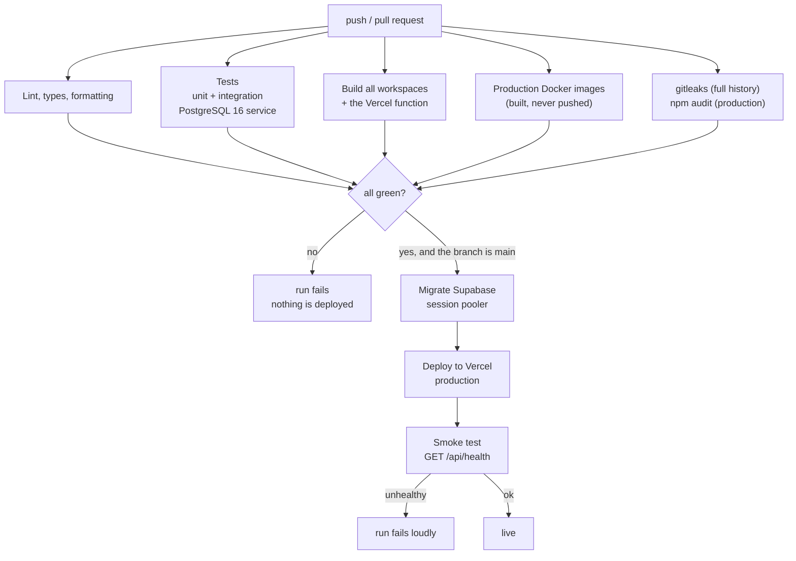
```mermaid
flowchart TD
    push["push / pull request"] --> quality["Lint, types, formatting"]
    push --> test["Tests<br/>unit + integration<br/>PostgreSQL 16 service"]
    push --> build["Build all workspaces<br/>+ the Vercel function"]
    push --> docker["Production Docker images<br/>(built, never pushed)"]
    push --> security["gitleaks (full history)<br/>npm audit (production)"]

    quality --> gate{"all green?"}
    test --> gate
    build --> gate
    docker --> gate
    security --> gate

    gate -- "no" --> stop["run fails<br/>nothing is deployed"]
    gate -- "yes, and the branch is main" --> migrate["Migrate Supabase<br/>session pooler"]
    migrate --> deploy["Deploy to Vercel<br/>production"]
    deploy --> smoke["Smoke test<br/>GET /api/health"]
    smoke -- "unhealthy" --> fail["run fails loudly"]
    smoke -- "ok" --> done["live"]
```

The five CI jobs run in parallel; they share nothing, so the run takes about as
long as its slowest job rather than their sum.

| Job                            | What it is for                                                                                                                                                                 |
| ------------------------------ | ------------------------------------------------------------------------------------------------------------------------------------------------------------------------------ |
| **Lint, types and formatting** | `npm run lint`, `typecheck`, `format:check`                                                                                                                                    |
| **Tests**                      | The full suite against a PostgreSQL 16 service container, with `<db>_test` created the same way `docker/postgres/initdb` does                                                  |
| **Build all workspaces**       | `build:vercel` — the three workspaces in order, then a typecheck of the serverless function against the backend's emitted declarations                                         |
| **Production Docker images**   | `docker compose -f docker-compose.prod.yml build`, so a broken Dockerfile fails here rather than the next time the stack is started                                            |
| **Secret scan and audit**      | gitleaks over the **whole history** (`--redact`, so a finding names the rule and file, never the secret), and `npm audit --omit=dev`: high is reported, critical fails the run |

`VITEST_MAX_WORKERS` defaults to 4 on a runner rather than the 2 this laptop
needs, and is overridable with a repository variable of the same name.

**Deployment is gated, single-path and verified.**

- Vercel's own Git integration is switched off in
  [`vercel.json`](vercel.json) (`git.deploymentEnabled.main: false`), so the
  only thing that can deploy is the workflow. Two paths to production would
  mean a commit could go live without passing CI.
- Migrations run **before** the new code, over the **session** pooler. They are
  safe to re-run: each file is recorded in `schema_migrations` and applied at
  most once, under a session-scoped advisory lock that stops two runs
  overlapping. The transaction pooler cannot hold that lock, and the direct
  host is IPv6-only, which a GitHub runner cannot reach.
- The smoke test is the definition of done. A build can succeed while the
  function cannot reach the database — a paused Supabase project does exactly
  that — so the run only goes green once `/api/health` reports the database
  reachable.
- `concurrency: deploy-production` with `cancel-in-progress: false`: never two
  deployments at once, and never one cancelled half-way through a migration.

**Secrets** the workflow needs, as GitHub Actions repository secrets:
`VERCEL_TOKEN`, `VERCEL_ORG_ID`, `VERCEL_PROJECT_ID` and
`PRODUCTION_MIGRATION_DATABASE_URL` (the session pooler URL, port 5432).

---

## Limitations

Honest about what this is and is not:

- **Priority scoring is a mock**, as the brief specifies. Final year,
  programme relevance and graduation urgency are plausible stand-ins for
  whatever a real registrar would weigh; the weights are configurable per
  window, but they are not a real institution's policy.
- **Allocation runs inside the backend process**, not in a worker. It is a pure
  function and takes about 14 ms for 150 students over 20 courses, so for this
  scale a queue and a separate container would be ceremony. The strategy
  interface is there so one can be added without restructuring.
- **One elective per student per window.** The model allows exactly one, which
  is what the brief describes; multi-course allocation would change the
  matching problem, not just the code.
- **One registration window at a time** is what the UI assumes, even though the
  schema allows several.
- **No live updates beyond seat counts.** Seats poll every 10 seconds; results
  and waitlist positions refresh when the page is loaded or retried. There are
  no WebSockets.
- **Rate limiting is weaker on the live site than under Docker**, because the
  limiter's counters live in each serverless instance's memory rather than in a
  shared store. See [Deployment](#deployment); Upstash Redis is the fix.
- **No staging environment.** CI gates every deployment, but there is one
  database and one deployment: a migration is tried for the first time against
  production. Preview deployments are disabled precisely because they would
  otherwise share that database.
- **E-mail defaults to Mailpit.** The SMTP mailer is real and every setting
  comes from `.env`, so pointing it at a relay such as Brevo is configuration
  rather than code — but deliverability, bounces and unsubscribes are the
  relay's problem, and nothing here tracks them.
- **No bulk student self-service.** A student cannot correct their own record,
  by design — but that means a wrong record needs a registrar.

---

## Future scope

- **More allocation methods.** The engine takes a new strategy as one class and
  one `case`; the factory's `default` branch takes a `never`, so the build
  fails until the case exists. A **weighted lottery** is the obvious next one —
  random within priority bands, which some institutions prefer precisely
  because it cannot be gamed — alongside a proper serial dictatorship and a
  course-proposing variant for comparison.
- **An allocation simulator**, so a registrar can try weights against last
  term's data before freezing a policy.
- **A help page with a captioned video** walking through registration. It is
  specified but not built; `/student/help` currently redirects to the dashboard
  rather than showing an unfinished page.
- **A `/dev/javascript-lab` page**, hidden in production, demonstrating the
  language concepts interactively. The written version is
  [docs/javascript-concepts.md](docs/javascript-concepts.md).
- **Deployment**: a hosted environment, a CI pipeline running lint, typecheck,
  tests and build on every push, and real SMTP.
- **A worker container and a job queue** if allocation ever has to run for tens
  of thousands of students, plus Redis for seat counts if polling stops being
  enough.
- **Analytics for the registrar**: demand trends across terms, which
  prerequisites block the most students, how often add/drop is used.
- **A faculty role**, between student and registrar, able to see their own
  courses' rosters without administrative rights.
