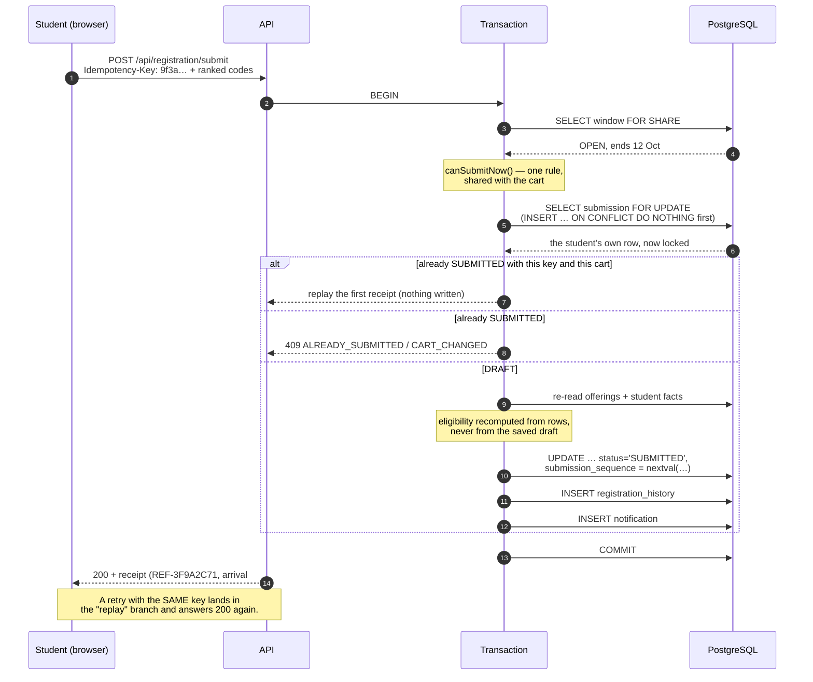
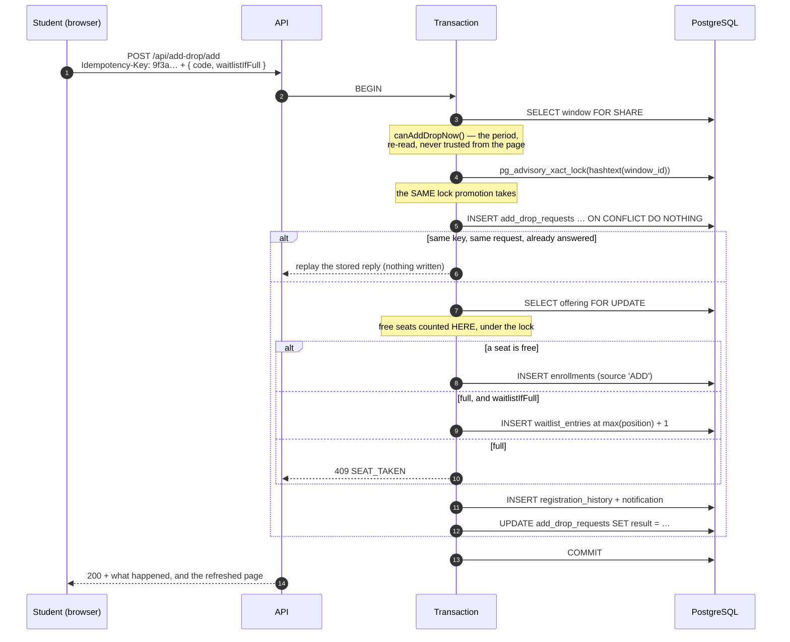

# Concurrency: the atomic submit, the atomic promotion, and the seat race

When registration opens, a few hundred students press **Submit** inside the
same minute, several of them twice because the first click seemed slow. Months
later, seats free up and the waitlists behind them move on their own, sometimes
several at once. Later still, add/drop opens and a hundred students compete for
ten real seats while other students are giving seats away. This document
explains exactly what the server guarantees in all three cases, how each
guarantee is enforced, and how to demonstrate it.

## What submitting is — and is not

Submitting a cart **does not take a seat**. Allocation is a batch that runs
after the window closes (see `docs/ALLOCATION.md`). A submit records a ranked,
validated, immutable list of preferences and the order it arrived in.

That makes the guarantees for this phase precise:

| #   | Guarantee                    | Meaning                                                                        |
| --- | ---------------------------- | ------------------------------------------------------------------------------ |
| 1   | **No duplicate submissions** | One student has at most one `SUBMITTED` row per window — ever.                 |
| 2   | **No partial submissions**   | Either every ranked item, the history row and the notification exist, or none. |
| 3   | **Idempotent retries**       | The same `Idempotency-Key` replays the first result; it never writes twice.    |
| 4   | **A correct arrival order**  | Every submission gets a unique, gap-free number from a database sequence.      |

The seat race — 100 students competing for 10 seats — is add/drop's problem,
where a seat really is taken. It has a section of its own below.

## The transaction, step by step

`backend/src/services/submitService.ts`. Everything below step 0 runs inside
one `withTransaction(pool, …)`; any throw rolls all of it back.



### Why each lock is the one it is

- **`SELECT … FOR SHARE` on the window.** Many submits read the window at
  once and must not block each other, but an admin closing the window in the
  middle of them must wait. `FOR SHARE` allows readers to share and blocks the
  writer; `FOR UPDATE` would serialise every submit behind one lock for no
  reason.
- **`SELECT … FOR UPDATE` on the student's own submission row.** This is the
  row that decides "have I submitted?", so exactly one transaction may hold it
  at a time. Because it is one row per student, students never queue behind
  each other — only a student's own duplicate requests do.
- **`INSERT … ON CONFLICT DO NOTHING`, then a locking re-read.** Two requests
  from the same student can arrive before any row exists. Both try to insert;
  one wins, the other does nothing, and both then `SELECT … FOR UPDATE` the
  same row. They meet on one row instead of creating two.

### Idempotency

The browser generates a UUID with `crypto.randomUUID()` **when the confirm
dialog opens**, and sends it in the `Idempotency-Key` header. Every retry of
that attempt reuses it (`frontend/src/pages/student/cart/CartPage.tsx`).

Inside the lock:

- same key **and** same cart → the original receipt is returned, nothing is
  written;
- same key, different cart → `409 CART_CHANGED`;
- different key on a submitted cart → `409 ALREADY_SUBMITTED`.

A unique constraint on `preference_submissions.idempotency_key` is the last
line of defence and is translated into a clear 409 rather than a 500.

### The arrival order

`submission_sequence` comes from `nextval('preference_submission_sequence')`,
taken inside the transaction. A sequence is atomic and never hands the same
value to two callers, so the order is the server's, not the client's clock.
FCFS allocation reads it directly.

### Database backstops

Application code can be wrong; the schema should still hold.

- `preference_submissions` has a unique `(student_id, window_id)` and a unique
  `idempotency_key` (migration 0004).
- A trigger in migration 0004 makes a `SUBMITTED` row immutable, so nothing
  can quietly rewrite a submission afterwards.
- Migration 0008 freezes the window's policy and its set of offered courses
  once it leaves `DRAFT`.

## Waitlist promotion: one window at a time

Submitting does not take a seat. Promotion does, and it takes them in a
cascade: releasing a lower-ranked seat frees that seat for someone else, so a
single withdrawal can touch several courses. Two of those running at once is
the interesting case.

**The lock is `pg_advisory_xact_lock(hashtext(window_id))`**, taken as the
first thing `processFreedSeats` does.

### Why an advisory lock, and not a row lock

The obvious alternative is to lock the offering rows. It does not work here,
because a cascade does not know in advance which courses it will touch — it
learns that as it goes, from whichever student happens to be next in line. Two
cascades that discover their courses in opposite orders take those row locks in
opposite orders, which is a textbook deadlock. PostgreSQL would detect it and
kill one transaction, turning a correct withdrawal into a 500 for reasons the
administrator could not act on.

Serialising promotion per window removes the ordering problem instead of
gambling on it. Promotions are rare and short — the demo window's largest
cascade is two steps — so the contention this creates costs nothing, while the
alternative is a class of failure that only appears under load.

### Why transaction-scoped

`pg_advisory_xact_lock` is released by COMMIT or ROLLBACK, automatically. A
session-scoped lock (`pg_advisory_lock`) would have to be released by hand, and
a connection returned to the pool still holding one would wedge every later
promotion in that window — including the retry.

`hashtext` is what turns the window's UUID into the `bigint` the advisory lock
functions take. Two different windows could in principle hash to the same key;
the only consequence is that one waits for the other, which is the behaviour
being asked for anyway.

### The offering row is still locked

Inside the advisory lock, each course is read `FOR UPDATE` before its free
seats are counted, so the count cannot be stale by the time the seat is given
out. And the trigger on `enrollments` remains the final guard: its CHECK on
`allocated_count` rejects any statement that would overbook, however the code
got there.

### What the tests prove

`tests/integration/waitlistConcurrency.test.ts`:

- **20 simultaneous withdrawals from one course** — all 20 succeed, 20 students
  are promoted, the course ends exactly full, and no student holds two seats.
- **Two withdrawals on different courses with overlapping cascades** — neither
  deadlocks, neither overbooks, and nobody is promoted twice.
- **A sweep racing a withdrawal** — both return 200.

## The seat race: 100 students, 10 seats

Submitting does not take a seat. Add/drop does, and this is where the promise
gets hard: a hundred students press "Add" in the same second on a course with
ten free seats, while other students are dropping seats that the waitlists
behind them are owed.

The guarantees, precisely:

| #   | Guarantee                            | Meaning                                                                  |
| --- | ------------------------------------ | ------------------------------------------------------------------------ |
| 5   | **No overbooking**                   | A course never holds more ACTIVE enrolments than its capacity. Ever.     |
| 6   | **No duplicate enrolment**           | A student holds at most one elective per window, however they got it.    |
| 7   | **No stolen seats**                  | A freed seat goes to the queue, never to somebody adding at that moment. |
| 8   | **A failed swap changes nothing**    | The loser of a race keeps the seat they had, and hears why.              |
| 9   | **Unique, consecutive queue places** | 90 losers get positions 1–90, each exactly once.                         |

### The two locks, and why both

`services/addDropService.ts`, inside one `withTransaction`:



- **`SELECT … FOR SHARE` on the window.** Exactly the reasoning from the submit:
  a hundred students read the period at once and must not queue behind each
  other, while an admin moving the period (`FOR UPDATE`) waits for the ones
  already in flight.

- **`pg_advisory_xact_lock(hashtext(window_id))`, taken second and before any
  offering row.** This is the lock promotion already uses, and using _the same
  one_ is the whole point. A drop's promotion cascade discovers its courses as it
  goes; an add knows its course up front. If they took row locks independently,
  a cascade walking A→B and a swap walking B→A would take them in opposite
  orders and deadlock — PostgreSQL would detect it and kill one transaction,
  turning a correct add into a 500 the student can do nothing about.

  Serialising per window removes the ordering problem instead of gambling on it.
  It also, as a side effect, makes two simultaneous adds _by the same student_
  impossible to interleave.

- **`SELECT … FOR UPDATE` on the offering row, inside all that.** The free-seat
  count the decision rests on is read here, under the lock, so it cannot be
  stale by the time the seat is taken. This is what turns "the page said 3 seats
  left" into either a seat or an honest `SEAT_TAKEN`.

The ceiling of this design is stated plainly: **one add/drop action per window
at a time.** Measured, 100 requests on the demo data settle in about 3.4
seconds — roughly 34 ms each, most of it the promotion check — which for a
registrar's add/drop period is nothing. If a future deployment needed more
throughput, the upgrade is per-course locks with a fixed acquisition order (sort
the course ids) plus a separate lock for promotion cascades; the reason that is
not the design today is that it buys throughput nobody needs with a class of
deadlock that only appears under load.

### Why a drop and an add cannot let the adder steal the seat

This is the case worth spelling out, because it is the one an administrator will
ask about.

Student A holds the last seat in AI401 and drops it. Student C, who is not on
the waitlist, presses "Add AI401" at the same instant. Student B has been
waiting for AI401 since the run. Who gets it?

**B, always.** Both requests need the window's advisory lock, so one of them
runs to completion before the other starts. There are only two orders:

1. **The drop goes first.** Inside its transaction it releases A's seat and
   immediately calls `processFreedSeats`, which promotes B into it — before the
   COMMIT, and therefore before any other transaction can see the seat at all.
   C's add then locks the offering row, counts the seats, finds it full again,
   and gets `SEAT_TAKEN` with the offer to join the queue.
2. **The add goes first.** It locks the offering row while A still holds the
   seat, so the course is full: `SEAT_TAKEN`. The drop then runs and gives the
   seat to B.

There is no third order, and no window in between, because the freed seat and
the promotion that fills it are the same transaction. That is the design rule
from Phase 9 — _every path that frees a seat calls `processFreedSeats` on its
own client_ — doing the work it was written for.

A seat can still reach an adder, of course: when nobody eligible is waiting for
it. That is not a stolen seat, it is an empty one.

### Why nobody ends up with two electives

Three different code paths insert into `enrollments`: allocation, promotion, and
add/drop. The application checks the invariant in all three, and the database
holds it regardless:

```sql
CREATE UNIQUE INDEX enrollments_one_active_per_student_window_idx
  ON enrollments (student_id, window_id) WHERE status = 'ACTIVE';
```

Adding that index (migration 0011) fixed the order every seat move has to take:
**release the old seat, then take the new one.** Promotion used to do it the
other way round, which briefly left two ACTIVE rows for one student — invisible
in practice, and rejected outright by the index. Swapping follows the same
order, and a failure anywhere in between rolls both statements back.

The overbooking guard is older and unchanged: the trigger on `enrollments`
maintains `registration_window_courses.allocated_count`, and its CHECK
(`allocated_count <= capacity`) rejects the statement that would exceed it. The
`FOR UPDATE` above is what makes the application agree with the database; the
CHECK is what makes the database right anyway.

### What the tests prove

`tests/integration/addDropConcurrency.test.ts`, every case releasing its
requests together and then asking the database what it actually holds:

- **100 students, 10 free seats, one "add, or waitlist if full" each**: exactly
  10 seats taken, exactly 90 queue places, no overbooking, nobody holding two,
  and the 90 positions unique and consecutive.
- **A drop racing an add by a student who is not waiting**: the waiting student
  gets the seat; the adder never holds it.
- **20 students swapping into a course with 5 free seats**: 5 succeed, 15 are
  refused with `SEAT_TAKEN` — not a generic error — and all 15 still hold
  exactly the seat they started with.
- **10 copies of one attempt (one idempotency key)**: one seat, one history row.
- **Two different keys from one student at once**: exactly one succeeds.
- **20 simultaneous drops from a full course with a queue behind it**: 20
  promotions, the course ends exactly full, and the courses those students
  released end empty.

`addDrop.test.ts` adds the rollback proof: a fault injected after the seat has
moved leaves no enrolment, no promotion, no history row, no notification and no
usable idempotency key — and the student can simply try again. The fault point
only exists when `NODE_ENV === 'test'`.

`services/waitlistPromotionProperties.test.ts` throws random sequences of
withdrawals, capacity changes, adds, drops, swaps, joins and leaves at hundreds
of random worlds, and checks after every one that no course is overbooked, no
student holds two seats or a seat they never asked for, no seat is left free
while an eligible student waits for it, and nobody is left waiting for something
they rank below what they hold.

### The live demonstration

```bash
npm run demo:reset -- --stage=add-drop
npm run demo:seat-race
```

It prepares the race honestly — the course the most free students are actually
eligible for, its queue served first through the admin capacity endpoint, so the
ten seats belong to nobody — then fires 100 simultaneous requests at the running
API and prints enrolled, waitlisted, overbooked, duplicate enrolments and
whether the waitlist positions are unique and consecutive. It refuses to run
when `NODE_ENV=production`.

Inside Docker: `npm run docker:demo:seat-race`.

Measured on the demo data:

```
  course                MG301 Financial Management
  capacity              16, with 10 free when the burst was released
  students racing       100, none holding an elective
  requests sent         100 (one "add, or waitlist if full" each)
  responses             200×100
  outcomes              ADDED×10  WAITLISTED×90
  wall time             3374 ms

  PASS  enrolled                       10 (must be 10)
  PASS  waitlisted                     90 (must be 90)
  PASS  overbooked                     0 (must be 0)
  PASS  duplicate enrollments          0 (must be 0)
  PASS  waitlist positions unique      90 entries, all distinct
  PASS  waitlist positions consecutive 1–90 for 90 entries
```

## Single-use links: why redeeming is a transaction

An activation or reset link must work exactly **once**. Two requests can carry
the same token at the same moment — a double-clicked button, a retried request,
a link opened in two tabs — and only one of them may set a password.

Redeeming is therefore one transaction over a **locked token row**:

```text
BEGIN
  SELECT … FROM account_tokens t JOIN users u ON u.id = t.user_id
   WHERE t.token_hash = $1
   FOR UPDATE OF t                 -- the token row, not the user's
  …judge it: purpose, consumed_at, expires_at, the account's is_active…
  UPDATE account_tokens SET consumed_at = now()
   WHERE id = $1 AND consumed_at IS NULL     -- 0 rows = somebody else won
  UPDATE users SET password_hash = $2, password_changed_at = now()
  UPDATE account_tokens SET consumed_at = now() WHERE user_id = … -- every other link
COMMIT
```

**The lock is on the token, not the user.** Two people redeeming _different_
links for the same account is fine and should not serialise; the same link
twice is what must not happen. The second request blocks on the row until the
first commits, then reads `consumed_at` set and is refused.

**The `WHERE consumed_at IS NULL` is not redundant.** It is the guard that
would still hold if the lock were ever dropped or the isolation level changed:
the spend either changes exactly one row or the redemption fails. Belt and
braces, in the same spirit as the freeze triggers backing up the window rules.

**Setting a password spends every outstanding link**, not just the one used. A
reset requested while an invitation was pending must not still work afterwards.

The same shape covers the **CSV import**: every valid row is created inside one
transaction, so a failure part-way through leaves the file entirely unimported
rather than half applied. The invitations that follow are the deliberate
exception — a bounced address must not cost thirty created accounts — and the
report says how many were sent so the rest can be invited again.

## The pool deadlock this caught

The first version of step 4 re-validated the cart through the **pool-bound**
repositories while already holding a transaction client. With `max: 5`, five
concurrent submits each held one client and waited for a sixth that could
never come: 100 simultaneous submits hung until the test timed out at 120 s.

The fix is the rule now written into the service's types: every read inside a
transaction goes through a repository bound to _that transaction's_ client
(`catalogueFor`, `studentsFor`, `preferencesFor`, …). The concurrency suite
went from a timeout to passing in 47 s.

> If a service takes both a pool-bound and a client-bound repository, the
> client-bound one is not an optimisation. It is the only correct choice
> inside the transaction.

## Proving it

### The test suite

`backend/tests/integration/submitConcurrency.test.ts` (needs
`npm run docker:up`):

- **100 students, 200 simultaneous requests** (each student fires their submit
  and a duplicate with the same key, all released together): exactly 100
  `SUBMITTED` rows, 100 distinct students, 100 unique and gap-free sequence
  numbers, no partial cart, exactly one history row and one notification each.
- **20 different keys for one student, at once**: exactly one succeeds; the
  rest are 409 (or 429 from the rate limiter). One row exists.
- **A submit racing a cart PUT**: whichever wins, what is stored is what the
  winner validated — never a mixture.

`submit.test.ts` adds the rollback proof: a fault injected _after_ the row is
marked `SUBMITTED` leaves no submission, no sequence, no history and no
notification, and submitting again afterwards still works. The fault point
only exists when `NODE_ENV === 'test'`; in development and production
`armFault` throws, and there is no environment variable to set.

### The live demonstration

```bash
npm run demo:concurrent-submit
```

It fires N students (default 50) at the running API, each also sending a
duplicate with the same key, and prints requests sent, submissions created,
idempotent replays, duplicates (must be 0), partial carts (must be 0) and
whether the sequence numbers are unique and gap-free. It refuses to run when
`NODE_ENV=production`.

Inside Docker: `npm run docker:demo:concurrent-submit`.
