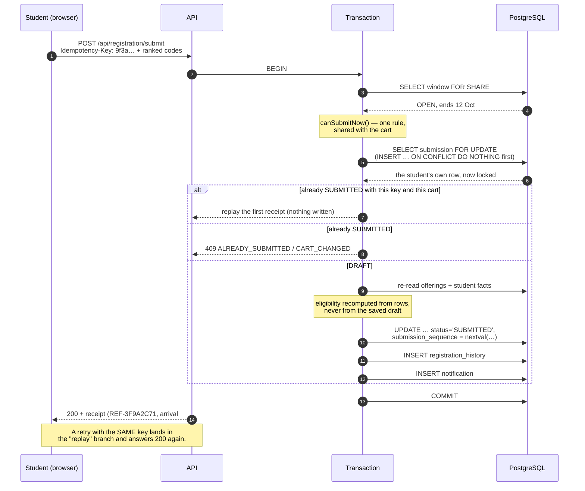

# Concurrency: the atomic submit

When registration opens, a few hundred students press **Submit** inside the
same minute, several of them twice because the first click seemed slow. This
document explains exactly what the server guarantees then, how each guarantee
is enforced, and how to demonstrate it.

## What submitting is — and is not

Submitting a cart **does not take a seat**. Allocation is a batch that runs
after the window closes (see `docs/ALLOCATION.md`). A submit records a ranked,
validated, immutable list of preferences and the order it arrived in.

That makes the guarantees for this phase precise:

| #   | Guarantee                    | Meaning                                                                        |
| --- | ---------------------------- | ------------------------------------------------------------------------------ |
| 1   | **No duplicate submissions** | One student has at most one `SUBMITTED` row per window — ever.                 |
| 2   | **No partial submissions**   | Either every ranked item, the history row and the notification exist, or none. |
| 3   | **Idempotent retries**       | The same `Idempotency-Key` replays the first result; it never writes twice.    |
| 4   | **A correct arrival order**  | Every submission gets a unique, gap-free number from a database sequence.      |

The seat race — 100 students competing for 10 seats — belongs to add/drop
(Phase 10), where a seat really is taken.

## The transaction, step by step

`backend/src/services/submitService.ts`. Everything below step 0 runs inside
one `withTransaction(pool, …)`; any throw rolls all of it back.



### Why each lock is the one it is

- **`SELECT … FOR SHARE` on the window.** Many submits read the window at
  once and must not block each other, but an admin closing the window in the
  middle of them must wait. `FOR SHARE` allows readers to share and blocks the
  writer; `FOR UPDATE` would serialise every submit behind one lock for no
  reason.
- **`SELECT … FOR UPDATE` on the student's own submission row.** This is the
  row that decides "have I submitted?", so exactly one transaction may hold it
  at a time. Because it is one row per student, students never queue behind
  each other — only a student's own duplicate requests do.
- **`INSERT … ON CONFLICT DO NOTHING`, then a locking re-read.** Two requests
  from the same student can arrive before any row exists. Both try to insert;
  one wins, the other does nothing, and both then `SELECT … FOR UPDATE` the
  same row. They meet on one row instead of creating two.

### Idempotency

The browser generates a UUID with `crypto.randomUUID()` **when the confirm
dialog opens**, and sends it in the `Idempotency-Key` header. Every retry of
that attempt reuses it (`frontend/src/pages/student/cart/CartPage.tsx`).

Inside the lock:

- same key **and** same cart → the original receipt is returned, nothing is
  written;
- same key, different cart → `409 CART_CHANGED`;
- different key on a submitted cart → `409 ALREADY_SUBMITTED`.

A unique constraint on `preference_submissions.idempotency_key` is the last
line of defence and is translated into a clear 409 rather than a 500.

### The arrival order

`submission_sequence` comes from `nextval('preference_submission_sequence')`,
taken inside the transaction. A sequence is atomic and never hands the same
value to two callers, so the order is the server's, not the client's clock.
FCFS allocation reads it directly.

### Database backstops

Application code can be wrong; the schema should still hold.

- `preference_submissions` has a unique `(student_id, window_id)` and a unique
  `idempotency_key` (migration 0004).
- A trigger in migration 0004 makes a `SUBMITTED` row immutable, so nothing
  can quietly rewrite a submission afterwards.
- Migration 0008 freezes the window's policy and its set of offered courses
  once it leaves `DRAFT`.

## The pool deadlock this caught

The first version of step 4 re-validated the cart through the **pool-bound**
repositories while already holding a transaction client. With `max: 5`, five
concurrent submits each held one client and waited for a sixth that could
never come: 100 simultaneous submits hung until the test timed out at 120 s.

The fix is the rule now written into the service's types: every read inside a
transaction goes through a repository bound to _that transaction's_ client
(`catalogueFor`, `studentsFor`, `preferencesFor`, …). The concurrency suite
went from a timeout to passing in 47 s.

> If a service takes both a pool-bound and a client-bound repository, the
> client-bound one is not an optimisation. It is the only correct choice
> inside the transaction.

## Proving it

### The test suite

`backend/tests/integration/submitConcurrency.test.ts` (needs
`npm run docker:up`):

- **100 students, 200 simultaneous requests** (each student fires their submit
  and a duplicate with the same key, all released together): exactly 100
  `SUBMITTED` rows, 100 distinct students, 100 unique and gap-free sequence
  numbers, no partial cart, exactly one history row and one notification each.
- **20 different keys for one student, at once**: exactly one succeeds; the
  rest are 409 (or 429 from the rate limiter). One row exists.
- **A submit racing a cart PUT**: whichever wins, what is stored is what the
  winner validated — never a mixture.

`submit.test.ts` adds the rollback proof: a fault injected _after_ the row is
marked `SUBMITTED` leaves no submission, no sequence, no history and no
notification, and submitting again afterwards still works. The fault point
only exists when `NODE_ENV === 'test'`; in development and production
`armFault` throws, and there is no environment variable to set.

### The live demonstration

```bash
npm run demo:concurrent-submit
```

It fires N students (default 50) at the running API, each also sending a
duplicate with the same key, and prints requests sent, submissions created,
idempotent replays, duplicates (must be 0), partial carts (must be 0) and
whether the sequence numbers are unique and gap-free. It refuses to run when
`NODE_ENV=production`.

Inside Docker: `npm run docker:demo:concurrent-submit`.
