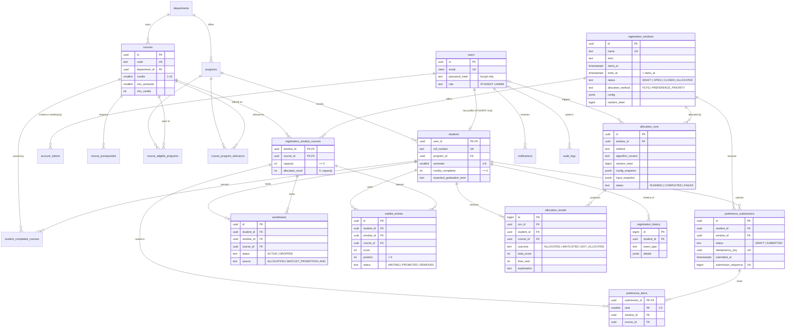

# Database

PostgreSQL 16 is the single source of truth. The schema is created by plain-SQL
migrations in [`backend/src/database/migrations`](../backend/src/database/migrations),
applied in order by `npm run migrate` and recorded in `schema_migrations`.

| Migration | Creates                                                                                                                                                                  |
| --------- | ------------------------------------------------------------------------------------------------------------------------------------------------------------------------ |
| 0001      | `schema_migrations`                                                                                                                                                      |
| 0002      | `users`, `departments`, `programs`, `students`, `courses`, `course_prerequisites`, `course_eligible_programs`, `course_program_relevance`, `student_completed_courses`   |
| 0003      | `registration_windows`, `registration_window_courses`                                                                                                                    |
| 0004      | `preference_submissions`, `preference_items`                                                                                                                             |
| 0005      | `enrollments`, `waitlist_entries` (and the seat-count trigger)                                                                                                           |
| 0006      | `allocation_runs`, `allocation_results`                                                                                                                                  |
| 0007      | `registration_history`, `notifications`, `audit_logs`                                                                                                                    |
| 0008      | The registration-policy freeze triggers                                                                                                                                  |
| 0009      | `allocation_runs.metrics` / `output_hash`, `allocation_results.explanation_detail`                                                                                       |
| 0010      | `enrollments.drop_reason`, `waitlist_entries.removal_reason`                                                                                                             |
| 0011      | The add/drop period, one elective per student, `add_drop_requests`                                                                                                       |
| 0012      | `account_tokens`, `users.is_active` / `password_changed_at` (and a nullable `password_hash`), `courses.is_active`, a nullable `student_completed_courses.completed_term` |

**Conventions**

- Primary keys are `UUID` (`gen_random_uuid()`) for entities the API addresses, and
  `BIGINT` identity for append-only rows (`allocation_results`,
  `registration_history`, `audit_logs`).
- Statuses, roles and methods are `TEXT` columns with named `CHECK` constraints
  instead of PostgreSQL enum types, so a value can be added with a normal
  migration. The same values exist as TypeScript unions in
  [`shared/src/domain/enums.ts`](../shared/src/domain/enums.ts).
- Every constraint has an explicit name, so the backend can turn a violation
  into a precise message.
- Academic terms are text in the form `YYYY-SPRING` / `YYYY-FALL`.
- Tables that change have `updated_at`, maintained by the `set_updated_at()` trigger.

## Entity-relationship diagram

## Tables

### Identity and academic structure

- **`users`** — every login. `email` is `CITEXT`, so uniqueness ignores case.
  `password_hash` must look like a bcrypt hash, so a plain-text password can't be
  stored — and since migration 0012 it may be **NULL**, which is exactly what an
  invited account is: created by an administrator, with no password until the
  student sets one from their invitation link.
  - `is_active` — a deactivated account cannot sign in. Nothing is deleted, so
    every submission, enrolment, waitlist place and history row stays intact and
    referentially whole. Reactivating restores access with the same password.
  - `password_changed_at` — the **session cut-off**. Every session token carries
    an `iat` (issued-at, whole seconds); a token issued before this instant is
    refused, which is how changing or resetting a password signs the other
    devices out without a session store to keep. It is written by the database's
    `now()`, never by a JS clock.

    Because `iat` is whole seconds **rounded down**, the cut-off is compared in
    whole seconds **rounded up** (`sessionCutoffSeconds`), and every new session
    is stamped at or after that cut-off (`sessionIssuedAtSeconds`). Rounding only
    one way would leave a token issued earlier in the same second alive, or
    refuse the very session the change hands back.
- **`account_tokens`** — single-use activation and password-reset links.
  - Only the token's **SHA-256 hash** is stored, so a leaked table cannot be
    turned back into working links. The token itself exists only in the e-mail.
    SHA-256 rather than bcrypt because the input is already 256 bits of CSPRNG
    output: there is nothing to slow an attacker down about, and the lookup has
    to be one indexed query.
  - `purpose` is `ACTIVATION` or `PASSWORD_RESET`; `consumed_at` marks a spent
    link; `expires_at` is 48 hours out and must be after `created_at`.
  - Issuing a link spends any outstanding one of the same purpose, so exactly one
    is ever live — which is what makes "resend the invitation" invalidate the
    previous e-mail. Setting a password spends **every** outstanding link.
  - A partial index over unconsumed rows serves the one lookup that matters:
    "the live token of this purpose for this user".
- **`departments`**, **`programs`** — each program belongs to a department.
- **`students`** — a 1:1 profile for a `STUDENT` user, holding program, semester,
  completed credits and expected graduation term. The mock priority inputs are
  **derived, not stored as flags**, so they can never contradict the facts:
  - final year: `semester >= 7`
  - program relevance: a row in `course_program_relevance`
  - graduation urgency: `expected_graduation_term` is on or before the window's `term`
- **`student_completed_courses`** — courses a student has passed, used for
  prerequisite checks and to block retaking a passed course. `completed_term` is
  nullable since migration 0012: the seed knows which term each course was
  passed in, but an administrator recording a record by hand supplies only the
  course **codes** — "they have passed CS201" is the fact the prerequisite check
  needs, and inventing a term to satisfy a NOT NULL would be worse than admitting
  the gap.

### Courses and their rules

- **`courses`** — the catalogue entry (code, credits, description,
  `min_semester`, `min_credits`). Seats are **not** stored here (see below).
  `is_active` (migration 0012) retires a course instead of deleting it: a course
  that has ever been offered is referenced by submissions, enrolments, waitlist
  entries and stored allocation results, so deleting it would destroy the
  evidence that a run is reproducible. A retired course stays in every window
  that already offers it and simply cannot be added to a new one.
- **`course_prerequisites`** — course → required course. A course can't require itself.
- **`course_eligible_programs`** — programs allowed to take a course. No rows
  means the course is open to every program.
- **`course_program_relevance`** — programs that get the "program relevance" bonus.

### Registration windows and offerings

- **`registration_windows`** — a registration period (e.g. _Fall 2026_) with
  status `DRAFT → OPEN → CLOSED → ALLOCATED`, the allocation method, its
  `config` (the `AllocationConfig` union: preference weights and priority
  points) and the stored `random_seed` for reproducible tie-breaks.
  Migration 0011 adds `add_drop_opens_at` / `add_drop_closes_at`: the period
  students may change their own enrolment in, which an admin sets once the
  window is `ALLOCATED`. Both ends or neither
  (`registration_windows_add_drop_dates_check`) — a period with only an opening
  time would be one that never closes. It is deliberately **outside** the frozen
  policy of migration 0008: extending add/drop changes no allocation rule.
- **`registration_window_courses`** — a course **offered** in a window, with
  `capacity` and `allocated_count`. The catalogue's live seat counts come from here.

### Registration cart

- **`preference_submissions`** — one row per student per window. It starts as a
  `DRAFT` (saved cart) and becomes `SUBMITTED` exactly once. On submit the server
  sets the `idempotency_key`, `submitted_at` and `submission_sequence` (from a
  database sequence). FCFS ranks students by this server-side sequence, never by
  a client clock.
- **`preference_items`** — up to five ranked courses per submission.

### Outcomes

- **`enrollments`** — a held seat (`ACTIVE`) or a dropped one (`DROPPED`, with
  `dropped_at`), and how it was obtained: `ALLOCATION`, `WAITLIST_PROMOTION` or
  `ADD` (taken during add/drop). Dropped rows are kept as history.
  `drop_reason` (migration 0010, extended by 0011) says why the seat went:
  `UPGRADED` (promoted somewhere better), `ADMIN_WITHDRAWAL`, `STUDENT_DROP` or
  `SWAPPED`. A CHECK ties it to the status, so an `ACTIVE` row never carries one
  and a `DROPPED` row always does.
- **`waitlist_entries`** — students queued for a full offering, ordered by
  `position`, which comes from the allocation `score`. Positions aren't renumbered
  after a promotion; readers use `ORDER BY position`. A student who joins a queue
  during add/drop is appended at `max(position) + 1` over **every** entry the
  course has had, so they land behind everyone the run placed rather than in a
  gap it left. Such an entry has no `preference_items` row behind it, which is
  why the waitlist reads outer-join the ranked preferences.
  `removal_reason` (0010, extended by 0011) is why a `WAITING` entry ended
  without a promotion: `INELIGIBLE`, `RANKED_BELOW_SEAT`, `STUDENT_LEFT` (they
  left it themselves) or `SEAT_ELSEWHERE` (they took a seat, and an unranked
  queue can no longer be shown to be an upgrade — see `docs/ALLOCATION.md`).
- **`allocation_runs`** — one per allocation execution. Stores the method,
  algorithm version, seed, config snapshot and input snapshot, so a run can be
  reproduced exactly, plus (migration 0009) the `metrics` it produced and an
  `output_hash` — a SHA-256 over the sorted decisions — which is what
  "Verify reproducibility" compares against. A CHECK makes both mandatory on a
  `COMPLETED` run and forbidden otherwise, and `finished_at >= started_at`, so
  both timestamps must come from the same clock: the database's.
- **`allocation_results`** — per run, student and ranked course: outcome,
  preference/priority/total score, final rank and the plain-language explanation
  shown to that student. Scores are `NULL` for FCFS, which doesn't score.
  Migration 0009 adds `explanation_detail` (the structured explanation the UI
  formats) and `waitlist_position`, which a CHECK ties to the `WAITLISTED`
  outcome: exactly the waitlisted rows have a place in a queue.

### Add/drop

- **`add_drop_requests`** — the idempotency ledger for the five student
  actions. Phase 7 could keep the key on `preference_submissions`, because a
  student has exactly one of those; add/drop actions repeat, so each attempt gets
  a row holding its `action`, the `request` as `jsonb`, and the `result` that was
  sent. A retry with the same key and the same request replays that result; the
  same key with a different request is refused. The request is compared with
  jsonb `=` **in the database**, because PostgreSQL stores jsonb keys in its own
  order and two `JSON.stringify` strings would disagree about identical requests.

### Timeline, notifications, audit

- **`registration_history`** — the student's timeline (`SUBMITTED`,
  `ALLOCATED`, `WAITLISTED`, `PROMOTED`, `ADDED`, `DROPPED`, `SWAPPED`,
  `WAITLIST_JOINED`, `WAITLIST_LEFT`, `WAITLIST_REMOVED`, …) with JSON details.
  Append-only.
  Its `details` JSON is a CONTRACT, not a scratch pad: one shape per
  `event_type`, published as the `HistoryEventDetail` union in
  `shared/src/api/activity.ts` and read by `backend/src/services/historyEvents.ts`.
  Several services write these rows — submit, allocation, promotion, add/drop,
  the admin withdrawal — and a writer that invents its own shape produces a
  timeline event the student's page cannot describe. (The demo seed did exactly
  that until Phase 11.) The reader is deliberately tolerant: a missing or
  malformed field becomes `null` rather than an exception, because these rows
  outlive the code that wrote them.

  The student's timeline is read newest-first by keyset on `id`, not `OFFSET`:
  `id` is the insert order, and a bulk allocation write gives hundreds of rows
  one `created_at`, so ordering on the timestamp could not break ties the way
  paging needs.

- **`notifications`** — messages to a user; `read_at` marks them read. Paged by
  keyset on `(created_at, id)` — exactly the ORDER BY and the
  `notifications_user_idx` prefix — so a message arriving mid-read cannot make
  a page repeat or skip a row. `read_at` is set by an `UPDATE … WHERE user_id`
  scoped in the SQL, never filtered afterwards.
- **`audit_logs`** — who changed what (old/new JSON values and a reason). Append-only.
  Capacity edits, window transitions, `ALLOCATION_RUN`, `ALLOCATION_VERIFY`,
  `WAITLIST_PROMOTION`, `ENROLLMENT_WITHDRAWN` and `ADD_DROP_PERIOD_UPDATED` are
  recorded here; it has no UI yet.

## How the database prevents overbooking and duplicates

The application will validate everything too, but these rules hold even if
application code has a bug or two requests race.

### Overbooking

| Rule                                                             | Mechanism                                                                                                                                                                                                                                                                                                                                                                                                                                                                            |
| ---------------------------------------------------------------- | ------------------------------------------------------------------------------------------------------------------------------------------------------------------------------------------------------------------------------------------------------------------------------------------------------------------------------------------------------------------------------------------------------------------------------------------------------------------------------------ |
| Capacity is never negative                                       | `registration_window_courses_capacity_check`: `capacity >= 0`                                                                                                                                                                                                                                                                                                                                                                                                                        |
| Seats taken never exceed seats available                         | `registration_window_courses_allocated_count_check`: `allocated_count BETWEEN 0 AND capacity`                                                                                                                                                                                                                                                                                                                                                                                        |
| The seat count can't drift from reality                          | Trigger `enrollments_sync_allocated_count` adds 1 when an `ACTIVE` enrollment appears and subtracts 1 when one is dropped or deleted. Inserting a seat beyond capacity makes the trigger's `UPDATE` violate the CHECK, so the **whole statement fails** and nothing is written.                                                                                                                                                                                                      |
| Concurrent enrollments can't both take the last seat             | The trigger's `UPDATE` locks the offering row, so concurrent enrollments in the same offering run one after another, and each sees the count the previous one committed. The integration test fires 8 simultaneous enrollments at a 3-seat offering: exactly 3 succeed. Promotion and add/drop also take an explicit `SELECT … FOR UPDATE` on that row before counting its free seats, so the application agrees with the database instead of relying on it (`docs/CONCURRENCY.md`). |
| Capacity can't be cut below the seats already held               | The same CHECK rejects `UPDATE … SET capacity` below `allocated_count`.                                                                                                                                                                                                                                                                                                                                                                                                              |
| You can only enroll in, wait for or rank a course that's offered | Composite foreign keys `(window_id, course_id) → registration_window_courses` on `enrollments`, `waitlist_entries` and `preference_items`.                                                                                                                                                                                                                                                                                                                                           |

### Duplicates

| Rule                                                    | Mechanism                                                                                                                                                                                                                                                                                                                                                                                                                                                           |
| ------------------------------------------------------- | ------------------------------------------------------------------------------------------------------------------------------------------------------------------------------------------------------------------------------------------------------------------------------------------------------------------------------------------------------------------------------------------------------------------------------------------------------------------- |
| One submission per student per window                   | `preference_submissions_student_window_key`: `UNIQUE (student_id, window_id)`                                                                                                                                                                                                                                                                                                                                                                                       |
| A retried submit can't create a second submission       | `preference_submissions_idempotency_key_key`: `UNIQUE (idempotency_key)`                                                                                                                                                                                                                                                                                                                                                                                            |
| A submitted cart is complete and final                  | `preference_submissions_submitted_fields_check` requires key, time and sequence once `SUBMITTED`. Triggers reject any later change to a submitted submission or its items (SQLSTATE `55000`).                                                                                                                                                                                                                                                                       |
| FCFS order is unambiguous                               | `UNIQUE (submission_sequence)`, assigned from a database sequence                                                                                                                                                                                                                                                                                                                                                                                                   |
| A course appears once in a cart                         | `preference_items_submission_course_key`: `UNIQUE (submission_id, course_id)`                                                                                                                                                                                                                                                                                                                                                                                       |
| Each rank is used once, and only ranks 1–5 exist        | Primary key `(submission_id, rank)` and `preference_items_rank_check`: `rank BETWEEN 1 AND 5`                                                                                                                                                                                                                                                                                                                                                                       |
| An item belongs to its submission's window              | Composite FK `(submission_id, window_id) → preference_submissions (id, window_id)`                                                                                                                                                                                                                                                                                                                                                                                  |
| One active seat per student per course                  | Partial unique index `enrollments_one_active_per_student_course_idx` on `(student_id, course_id) WHERE status = 'ACTIVE'` (dropped rows don't block re-enrolling)                                                                                                                                                                                                                                                                                                   |
| **One elective per student per window**                 | Partial unique index `enrollments_one_active_per_student_window_idx` on `(student_id, window_id) WHERE status = 'ACTIVE'` (migration 0011). Three code paths insert enrolments — allocation, promotion and add/drop — and two simultaneous adds by one student lock different offering rows, so nothing in the row locks alone would stop them both succeeding. It also fixes the order every seat move must take: **release the old seat, then take the new one.** |
| A retried add/drop action can't act twice               | `add_drop_requests` primary key on `idempotency_key`, claimed with `INSERT … ON CONFLICT DO NOTHING` inside the action's own transaction                                                                                                                                                                                                                                                                                                                            |
| One waitlist spot per student per course                | Partial unique index `waitlist_entries_one_waiting_per_student_course_idx` `WHERE status = 'WAITING'`                                                                                                                                                                                                                                                                                                                                                               |
| "Next in line" is unambiguous                           | Partial unique index `waitlist_entries_waiting_position_idx` on `(window_id, course_id, position) WHERE status = 'WAITING'`                                                                                                                                                                                                                                                                                                                                         |
| One allocation run in progress per window               | Partial unique index `allocation_runs_single_running_idx` `WHERE status = 'RUNNING'`                                                                                                                                                                                                                                                                                                                                                                                |
| One result per student and course per run, ranks unique | `UNIQUE (run_id, student_id, course_id)` and `UNIQUE (run_id, course_id, final_rank)`                                                                                                                                                                                                                                                                                                                                                                               |
| One open registration window at a time                  | Partial unique index `registration_windows_single_open_idx` `WHERE status = 'OPEN'`                                                                                                                                                                                                                                                                                                                                                                                 |
| One account per e-mail, case-insensitively              | `users_email_key` on a `CITEXT` column                                                                                                                                                                                                                                                                                                                                                                                                                              |

### Retiring a course a live window offers

A course cannot be retired while a window that is `OPEN` or later offers it:
that would change what students are registering for mid-flight.
`adminCatalogueService.setActive` refuses it first, with a `409` naming the
windows, and migration 0012's `courses_refuse_deactivating_offered` trigger is
the backstop — in the same spirit as the freeze triggers below, it holds even if
the application code is wrong or the row is updated by hand.

### The frozen registration policy

Students rank courses against a published policy, so the rules that decide who
gets a seat must not change underneath them. Once a window leaves `DRAFT`,
migration 0008 makes the database refuse a change even if application code is
wrong, a script is run by hand, or two requests race:

| Rule                                                                                                                     | Mechanism                                                                                                            |
| ------------------------------------------------------------------------------------------------------------------------ | -------------------------------------------------------------------------------------------------------------------- |
| The allocation method, `config` (weights and priority points) and `random_seed` are fixed once the window is not `DRAFT` | Trigger `registration_windows_freeze_policy` (SQLSTATE `55000`)                                                      |
| The **set** of offered courses is fixed too                                                                              | Trigger `registration_window_courses_freeze_offerings` rejects `INSERT` and `DELETE` while the window is not `DRAFT` |
| Deliberately still allowed                                                                                               | The status transitions themselves, the window's name, term and schedule, and a course's `capacity`                   |

The service refuses the same change first, with a `409` and a message the admin
can act on ([`services/registrationWindowService.ts`](../backend/src/services/registrationWindowService.ts));
the triggers are the backstop. An integration test drives both paths: a `PATCH`
after opening returns 409, and a direct `UPDATE` of a frozen column raises.

### Other integrity rules

- Only `STUDENT` users can have a student profile: `students (user_id, user_role)`
  references `users (id, role)`, and `user_role` must be `'STUDENT'`. The same key
  stops a user with a profile being turned into an `ADMIN`.
- Consistent state/timestamp pairs: a `DROPPED` enrollment needs `dropped_at`; a
  `PROMOTED` waitlist entry needs `promoted_at`; a finished allocation run needs
  `finished_at`, and a `FAILED` one needs `error_message`.
- `registration_windows.config ->> 'method'` must equal `allocation_method`, and
  a `PREFERENCE_PRIORITY` config must contain `preferenceWeights` and `priorityPoints`.
- `allocation_results.total_score = preference_score + priority_score` whenever
  all three are present.
- `registration_history` and `audit_logs` reject `UPDATE`s: history is append-only.

### Not enforced by the database (by design)

- **Eligibility** (program, semester, credits, prerequisites) is a business
  rule evaluated by the backend
  ([`services/eligibilityRules.ts`](../backend/src/services/eligibilityRules.ts)),
  because it needs to explain every failing reason to the student.
- **Prerequisite cycles** (A needs B, B needs A) aren't blocked by a constraint.
  The seed data has none, and admin course editing doesn't exist yet.
- **Contiguous ranks** (1, 2, 3 without gaps) are checked by the submit service.
- **Not waitlisted and enrolled in the same course at once** spans two tables,
  so the service keeps it inside one transaction.

### Waitlist promotion (migration 0010)

Promotion has to be able to say WHY, so two nullable `TEXT` columns carry the
reason, each with a named CHECK mirroring a const tuple in
`shared/src/domain/enums.ts`:

| Column                            | Values                                         | CHECK                                 |
| --------------------------------- | ---------------------------------------------- | ------------------------------------- |
| `enrollments.drop_reason`         | `UPGRADED`, `ADMIN_WITHDRAWAL`, `STUDENT_DROP` | Set exactly when `status = 'DROPPED'` |
| `waitlist_entries.removal_reason` | `INELIGIBLE`, `RANKED_BELOW_SEAT`              | Set exactly when `status = 'REMOVED'` |

The student and admin waitlist pages read these directly rather than
reconstructing the reason from `registration_history`.

Nothing else was needed: `enrollments.source` already allowed
`WAITLIST_PROMOTION`, `registration_history.event_type` already allowed
`PROMOTED`, `DROPPED` and `WAITLIST_REMOVED`, and
`notifications.type` already allowed `WAITLIST_PROMOTION` — the schema was
built for this in Phase 3.

"Who is next in line" is answered by the existing unique partial index
`waitlist_entries_waiting_position_idx` on `(window_id, course_id, position)
WHERE status = 'WAITING'`, which is also what makes the next-in-line
unambiguous.

## Catalogue queries and indexes

A catalogue request runs a fixed number of queries, however many courses a
window offers:

1. The session user (`requireAuth`).
2. The current window.
3. **One** aggregated query for every offering: the course and department,
   seats, and demand as `count(*)` of SUBMITTED `preference_items` per course
   (a CTE). Prerequisites and eligible programmes come as `json_agg` arrays
   from two more CTEs.
4. For students only, in parallel with (3): their eligibility facts (programme,
   semester, credits and passed courses, via `array_agg`) and their own cart,
   seat and waitlist rows (one `UNION ALL`).

Eligibility is then computed by the pure TypeScript rule, and filtering,
sorting and paging happen in memory. That is because "eligible only" depends on
that rule, and a window has at most a few hundred offerings. An integration
test counts `pool.query` calls for 5 courses and for 25, and they are equal
(no N+1).

`EXPLAIN (ANALYZE, BUFFERS)` of the offerings query on the seeded data (20
offerings, 150 submissions, 474 preference items) takes 1.75 ms, with every
page read from shared buffers:

- The window's offerings use `registration_window_courses_pkey` (bitmap
  index scan on `window_id`).
- The other tables are read with sequential scans. At 5–474 rows that is
  cheaper than an index.
- Demand is a hash aggregate over the window's preference items.

With `enable_seqscan = off`, the demand aggregate uses the existing
`preference_items_window_course_idx` and
`preference_submissions_window_sequence_idx`. So the indexes needed at larger
volumes already exist, and **no new index was added**.

`GET /api/courses/seats` runs the same demand aggregate with only the seat
columns. Its ETag is a SHA-256 hash of the numbers, so an unchanged catalogue
costs one small query and an empty `304`.

## Test database

Integration tests use a separate database named `<POSTGRES_DB>_test`
(`course_registration_test` by default):

- The postgres container creates it on first start of an empty volume
  ([`docker/postgres/initdb`](../docker/postgres/initdb)). The test setup also
  creates it if an older volume doesn't have it.
- Vitest's global setup runs all migrations against it. Every test starts from
  empty tables (`TRUNCATE … RESTART IDENTITY CASCADE`).
- The test helpers refuse to connect to a database whose name doesn't end in
  `_test`, so the development data is never touched.
- The URL is `TEST_DATABASE_URL` if set, otherwise `DATABASE_URL` with `_test`
  appended to the database name.

## Seed data

`npm run seed` (or `npm run docker:seed`) empties every table and loads a
deterministic data set in one transaction. A seeded PRNG (mulberry32, seed
`20260901`) produces the same students every run. `npm run seed:demo-submissions`
then opens the window and records about 150 preference submissions through the
same constraints a real submit uses. Both commands are safe to re-run.

| Data                   | Contents                                                                                                                                                                                     |
| ---------------------- | -------------------------------------------------------------------------------------------------------------------------------------------------------------------------------------------- |
| Departments / programs | 5 / 5 (CSE, ECE, ME, Mathematics, Management)                                                                                                                                                |
| Courses                | 20, with prerequisites, program restrictions, minimum semester/credits                                                                                                                       |
| Students               | 300 (4 named demo accounts + 296 generated), semesters 1–8, completed courses consistent with prerequisites                                                                                  |
| Registration window    | _Fall 2026_ (`2026-FALL`), `DRAFT`, `PREFERENCE_PRIORITY`, weights P1–P5 = 100/80/60/40/20, priority final year +20, program relevance +25, graduation urgency +40, `random_seed` 2026091801 |
| Demo case              | _Artificial Intelligence_ (CS401): 20 seats, 118 eligible students. After demo submissions, 107 rank it first and 114 rank it at all                                                         |
| Oversubscribed         | Demand ÷ seats after demo submissions: CS401 AI 5.7×, CS404 Blockchain 3.4×, CS402 Cloud Security 2.4×, CS403 Distributed Systems 1.1×                                                       |
| Exactly full           | MG302 Entrepreneurship (40 requests, 40 seats)                                                                                                                                               |
| Undersubscribed        | CS405 Machine Learning 0.6×, ME302 Renewable Energy 0.3×, MA301 Numerical Methods 0.2×, EC302 VLSI Design (no requests)                                                                      |

Demo accounts are listed in the [README](../README.md#demo-accounts).
