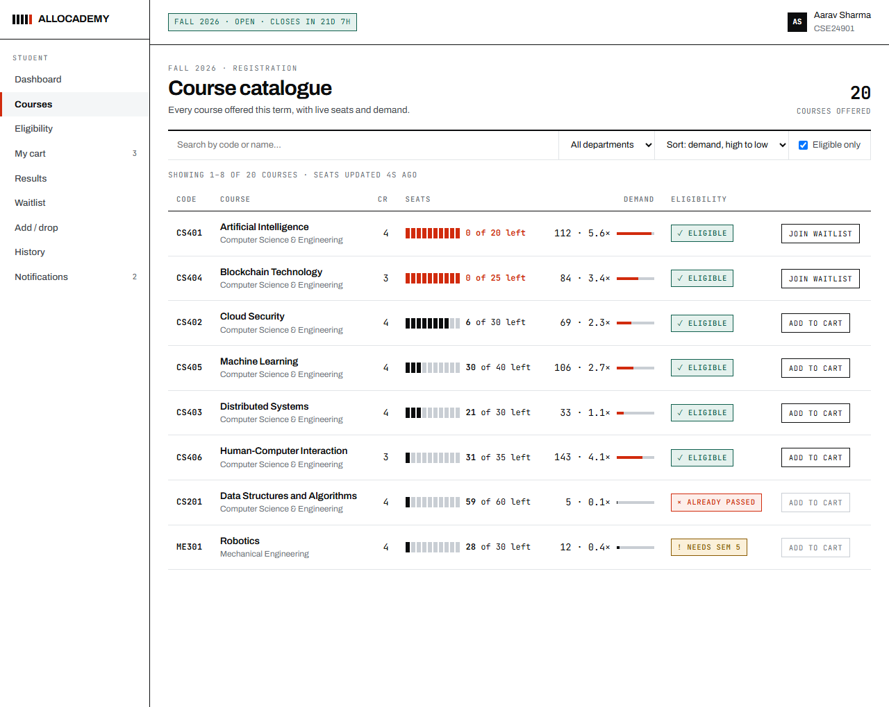
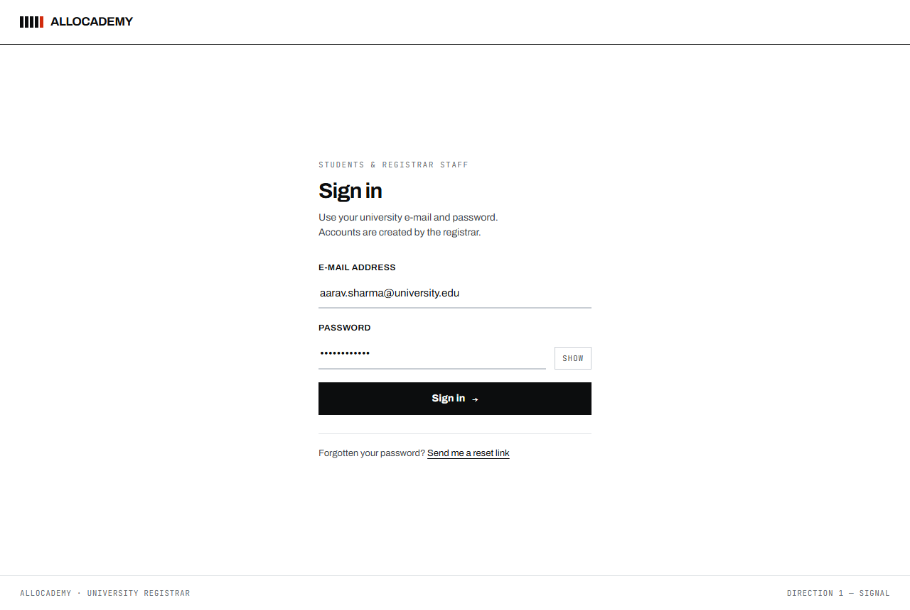
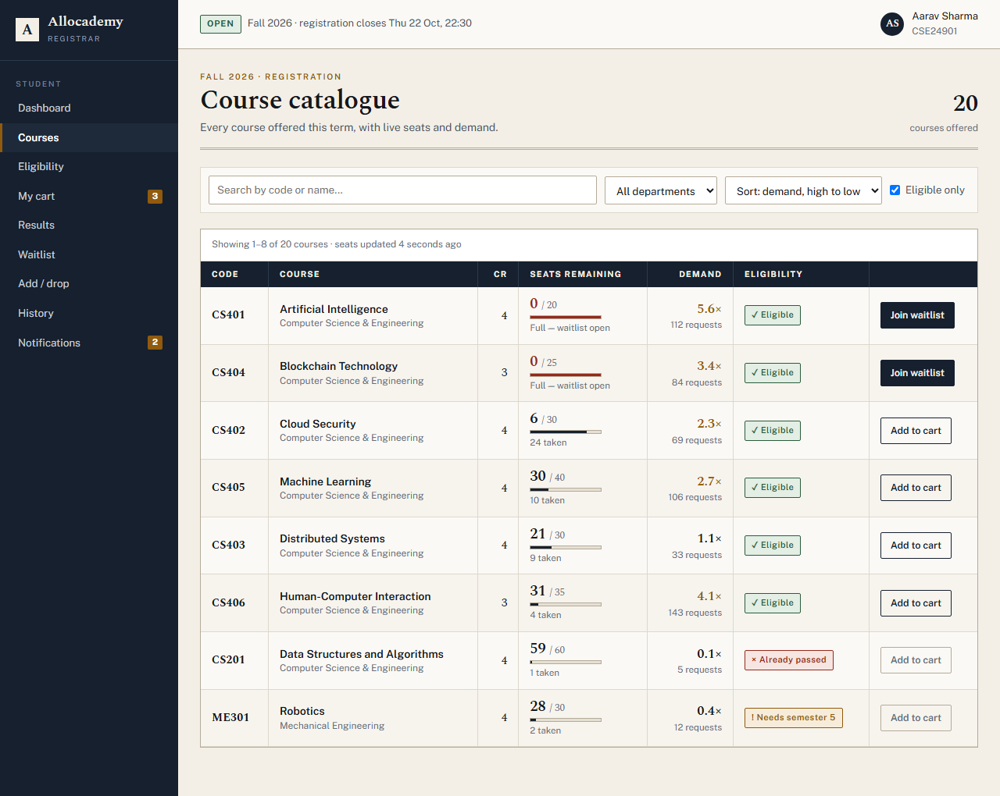
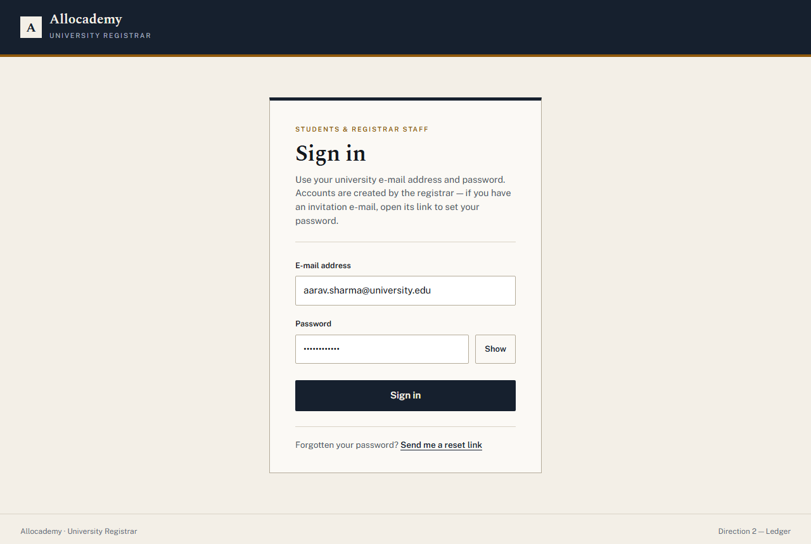
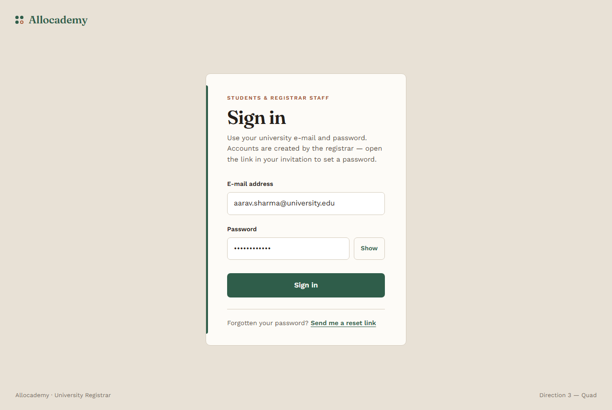

# Redesign

## The target (v1.6)

[`target-ui.png`](target-ui.png) is **the source of truth for how the product
looks**, and it overrides [`docs/DESIGN.md`](../DESIGN.md) wherever the two
disagree. It shows four screens in one image — Dashboard (top left), Course
catalogue (top right), Eligibility check (bottom left), My cart (bottom right)
— and every other page is built from the same system so the whole app reads as
one product.

It is 1536x1024. The four screens are not on an even grid — they are separated
by a dark gutter and the two columns are cut at different heights — so they are
found by code rather than by arithmetic. Each one is a **1440-wide viewport**
scaled to 760px, which makes one target pixel 1.895 CSS pixels.

### Two scripts, so nothing is eyeballed

| Script | What it does |
| --- | --- |
| [`scripts/measure-target.py`](../../scripts/measure-target.py) | Finds the four screens, samples the colours that cover each one, and measures the structure. Every number is reported as 1440-viewport pixels. `--json` for the machine-readable form. |
| [`scripts/compare-target.py`](../../scripts/compare-target.py) | Scales each screenshot to its screen's width, crops both to the height they share, and writes a side-by-side, a difference heatmap and a red/cyan overlay into [`compare/`](compare/), with a score per page. |

Both need Pillow and numpy (`pip install pillow numpy`), and the comparison
needs `docs/screenshots/*-1440-light.png` to exist.

```bash
python scripts/measure-target.py
npm run screenshots -- student-dashboard-1440
python scripts/compare-target.py dashboard
```

The score is the share of pixels differing by more than 32/255. It never
reaches zero: the app draws real data, and the target drew a story.

---

## The three directions it grew out of

Three genuinely different visual directions for **Allocademy**, each built as
two real pages with the real demo data: the **sign-in page** and the **student
course catalogue**. Open the HTML files directly, or look at
[`shots/`](shots/).

Each direction answers the same three questions differently:

1. **How does a seat count read at a glance?** The catalogue's whole job.
2. **What does the chrome say about the institution?** A registrar is not a
   start-up.
3. **What carries the hierarchy — type, rule, or colour?**

None of them uses a purple/indigo/blue gradient, glassmorphism, emoji, a row of
identical stat cards, or Inter-on-white.

| #   | Direction  | Files                                                               |
| --- | ---------- | ------------------------------------------------------------------- |
| 1   | **Signal** | [login](1-signal-login.html) · [catalogue](1-signal-catalogue.html) |
| 2   | **Ledger** | [login](2-ledger-login.html) · [catalogue](2-ledger-catalogue.html) |
| 3   | **Quad**   | [login](3-quad-login.html) · [catalogue](3-quad-catalogue.html)     |

Every colour pair in all three was checked against WCAG 2.2 AA with
[`contrast-check.mjs`](contrast-check.mjs) — `node docs/redesign/contrast-check.mjs`.
All 29 pairs pass at 4.5:1 or better. Six failed on the first pass and the
palettes were darkened until they cleared.

---

## 1 — Signal




**Colours.** Pure white paper, near-black ink (`#0c0d0e`), a single hot
vermillion (`#d12b0d`) that means _and only means_ "this is full / this is
over capacity". Deep teal and dark amber appear only inside status tags.

**Fonts.** **Archivo** — a tight, slightly condensed grotesque with real weight
contrast — for everything structural, and **JetBrains Mono** for every number,
code and label. Figures are tabular throughout, so columns line up to the digit.

**Layout.** A Swiss grid. No rounded corners anywhere, no shadows, no cards —
structure comes from one-pixel rules and a 2px rule under the page title. The
sidebar is separated by a full-height hairline rather than a block of colour.
Filters sit in a single ruled strip with no gaps between controls.

**Seats at a glance.** A **ten-segment meter**: filled segments are seats
taken. Full courses turn the whole meter vermillion. The exact figure
("6 of 30 left") is always printed beside it, so the meter is reinforcement,
never the only signal. Demand is a ratio in mono plus a bar scaled against a
6× ceiling, so 5.6× and 1.1× are instantly different lengths.

**What makes it distinctive.** It reads like a precision instrument — a
departures board or a trading terminal. It is the densest of the three: eight
courses fit where Quad fits six. The wordmark is the seat meter in miniature,
four filled and one open.

**Risk.** Unforgiving. With no cards or shadows to hide behind, every spacing
mistake shows.

---

## 2 — Ledger




**Colours.** Warm bone paper (`#f3efe7`), a deep ink-navy (`#16202e`) for all
chrome, and burnt ochre (`#915a0c`) as the single accent — on the rule under
the masthead, the active nav marker and every eyebrow. Forest green and oxblood
appear only in status tags.

**Fonts.** **Spectral** — a transitional serif with proper lining figures — for
headings, course codes and every number, paired with **Public Sans** for the
interface. Numbers in a serif is the point: it makes a seat count feel like a
figure on a statement rather than a UI widget.

**Layout.** A navy rail and a navy table header frame bone-coloured paper, so
the chrome recedes and the data is literally on a lighter surface. The table is
a true ledger: ruled columns, striped rows, a double rule under the page title.

**Seats at a glance.** A **ruled fraction** — the remaining figure set large in
Spectral over a hairline, the capacity small beneath it, and a thin meter of
seats taken under that, with the word ("Full — waitlist open", "24 taken")
spelled out. Demand is the ratio set large and right-aligned with the request
count beneath, the way an amount sits on a bill.

**What makes it distinctive.** It looks like something a registrar's office
would actually issue. It is the most _institutional_ of the three and the most
obviously trustworthy — which matters for a page whose job is to convince a
student the allocation was fair.

**Risk.** Formal. Handled badly it would tip into "government portal".

---

## 3 — Quad




**Colours.** Clay (`#e8e1d6`) around warm paper (`#fdfbf7`), deep forest green
(`#2f5d4a`) as the primary, terracotta (`#a04a26`) for anything full or blocked,
and ochre for warnings. Departments get a coloured spine down the left of each
row — forest for CS, terracotta for Mechanical, ochre for Maths — so scanning by
department needs no reading.

**Fonts.** **Fraunces** (variable, with optical sizing) for display and figures
— a soft-serif with real character, nothing like a default — and **Work Sans**
for the interface.

**Layout.** No boxed cards: the course list is a run of ruled rows against the
paper, with the sidebar floating on the clay outside it. The largest type on the
page by a wide margin is the page title, and the course names are set at 21px
serif, so the list reads as a catalogue rather than a grid.

**Seats at a glance.** A **twenty-dot matrix**, filled = taken. Twenty dots
whatever the capacity, because one dot per seat would make a 60-seat course
three times the height of a 20-seat one. The exact figures sit directly
underneath. Full courses turn terracotta and gain an explicit "Full — 85
waiting" tag.

**What makes it distinctive.** The warmest and most human of the three, and the
only one where colour does navigational work (the department spine). It would
suit a product that wants to feel like a place rather than a system.

**Risk.** The least dense — roughly six courses per screen against Signal's
eight — and the warm palette gives less contrast headroom to play with.

---

## Side by side

|                        | **1 Signal**           | **2 Ledger**            | **3 Quad**              |
| ---------------------- | ---------------------- | ----------------------- | ----------------------- |
| Feels like             | A precision instrument | A registrar's statement | A warm catalogue        |
| Paper                  | Pure white             | Bone, navy chrome       | Clay and cream          |
| Accent                 | One vermillion         | Navy + burnt ochre      | Forest + terracotta     |
| Display type           | Archivo (grotesque)    | Spectral (serif)        | Fraunces (soft serif)   |
| Numbers                | JetBrains Mono         | Spectral lining figures | Fraunces lining figures |
| Seats shown as         | 10-segment meter       | Ruled fraction          | 20-dot matrix           |
| Shape                  | No radii at all        | 2px radii               | 7–10px radii            |
| Density                | Highest                | High                    | Lowest                  |
| Colour does navigation | No                     | No                      | Yes (department spine)  |

All three keep the status rule: **never colour alone**. Every tag carries a
glyph and a word, and every seat display prints its numbers.
